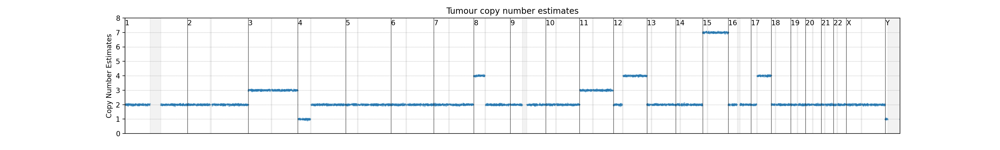
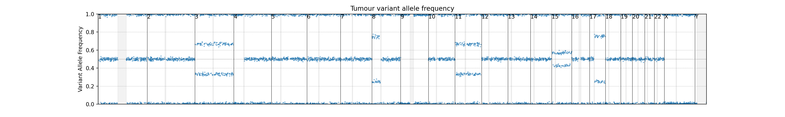
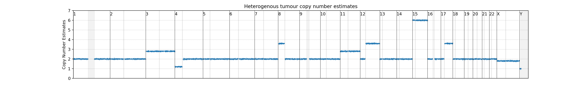
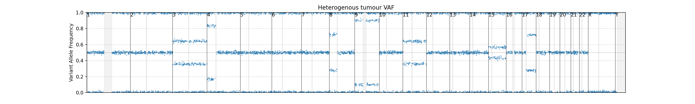

# Assignment 3: Structural Variants and Genome Graphs

### By Paul Wang and Chelsea Matthews

---

Data for this assignment is located in the `/data/assignment3/` directory

## Question 1: Copy number variations  (15 marks)

### Part 1a (3 marks)



The above figure shows the copy number estimates for various genomic regions inside a hypothetical human tumour sample.

List all the copy number variations that you can see from the figure.

### Part 1b (3 marks)



Similarly, the above figure shows the variant allele frequency of variants inside another hypothetical tumour sample. 

List all the CNVs that you can see from this figure.


### Part 1c (3 marks)

Now interpret the two figure together as data from the same sample.

List the CNVs that you can see by integrating both data sets.


### Part 1d (3 marks)

The above figures are from an hypothetical "pure" tumour sample. But in practice, we often get tumour samples which are mixed with some normal/non-tumourous cells.

For example, for the same tumour sample, now there is a percentage of normal cells included in the data, and the CN estimates and VAF graphs now look like this:




Estimate tumour purity of the sample from these figures.

### Part 1e (3 marks)

1. (1 mark) What do the grey bars in the figures represent? Why do they not contain any data points?

2. (2 marks) If we suspect that p-arm of chromosome 8 has fused with the q-arm of chromosome 17. How will you be able to determine whether a fusion event has occured? Will short-read NGS data (WGS, WES or RNA-seq) be able to detect such a fusion event?

## Question 2 (13 marks)

---

This question uses the same data for both parts. In `/data/assignment3/Q2` you should find these files:

```
mappable_region.fasta
compound_mono_allele.bam
compound_mono_allele.bam.bai
structuralvariants.vg
```

Download these files. Launch IGV. 

1. Load `mappable_region.fasta` as the genome file ("Genomes" -> "Load Genome from File...")
2. Load `compound_mono_allele.bam` as the alignment data ("File" -> "Load from File...")

### Question 2 Part 1: Structural variations (5 marks)

---

**1.1** Locate and list any breakpoints you can see in the data.

[2 marks]

**1.2** Identify all SV events and their associated breakpoints. 
Show the steps and reasonings for your answers. Include diagrams if you think it helps. If you want to use hand-drawn diagram, just take and submit a photo of your drawing, but make it's clearly legible.

[3 marks]


### Question 2 Part 2: Graph genome (8 marks)

---

**Q2.1** You have been provided with a file called `structuralvariants.vg` in the assignment data folder that contains a graph constructed from the reference sequence you used for the first part of this question.
In addition to the path representing the reference sequence, there are an additional three paths through the graph representing three different haplotypes.

When you visualise this graph, keep in mind that this graph models structural variants which are much larger than the small variants we have been looking at in the practicals.
The principle is the same except that the nodes are larger.
Also note that, for ease of visualisation, the nodes in this graph are very large.

Visualise the graph using `vg view -dunp graph.vg | dot -Tpdf -o pdf_filename` and provide a screenshot of your visualisation.

[2 marks]

**Q2.2**	What do each of the four parameters provided to vg view do?

[2 marks]

**Q2.3**	Describe how each of the three paths (path_one, path_two, and path_three) through the graph vary from the reference sequence.
You may reference the node numbers from the graph you visualised to do this and should consider using terms such as "deletion", "insertion" and "inversion" in your explanation.
If a variant doesn't seem to fit into one of these categories, call it a complex variant and describe what is happening. 

Remember that the variants should be described in terms of what the reference sequence looks like 
For example, a deletion is where a haplotype does not have a sequence at a particular location that is present in the reference sequence at that location.


[3 marks] 

**Q2.4**	One of these paths represents the haplotype of the sample you saw in Question 2 Part 1.
This haplotype contains the structural variation that you identified.
Which path is it? 

[1 mark]

## Question 3 (12 marks)


You have been provided with a reference sequence `hippogryph.fasta` and the most common variants found in the hippogryph population in `hippogryph.vcf`.

If you don't know what a hippogryph is, it's a mythical creature with the body of a horse and the head and wings of an eagle. 

Your task is to genotype a newly sequenced sample (frayfeather) which will help to understand more about the phenotypic characteristics of frayfeather. 
Details of the observed links between genotype and phenotype can be found in the genotype_phenotype.txt file.
Note that the phenotype associated with both the reference (REF) allele and the alternate (ALT) allele are described. 

**Q3.1** Construct a pan-genome graph from this data using the reference sequence and the .vcf.
When constructing this graph, keep in mind that we will be using it for genotyping.
Visualise this graph in a format of your choice and screenshot the first part of the graph up to and including the first variant.
Any visual form is acceptable but you should also include the code that you used to create this visualisation.

[3 marks]

**Q3.2** Align the provided reads in `frayfeather.reads` to the graph. 
Report your alignment command and the average read mapping identity using `jq .identity`.
Would you expect this value to be higher or lower if the graph contained only the **least** common variants found in the hippogryph population. 

[2 marks]

**Q3.3** Genotype the frayfeather sample.

For which variants does frayfeather have the alternate allele?
Provide the variant ID for these variants from column 3 of the vcf.

Using the provided table (genotype_phenotype.txt) describing the phenotypes associated with each variant (for both the REF and ALT allele), list frayfeather's phenotypic characteristics associated with variants v1, v2, v3, and v4 (found in the ID column).
Note that the hippogryph has a haploid genome.

Comment on whether or not you think frayfeather would be a good choice for a long flight.

[4 marks]

**Q3.5** Conceptual - How can using a pan-genome graph reduce reference bias?

[2 mark]

**Q3.6** Conceptual - In transcriptomics experiments, we align reads generated from RNA to a reference genome and determine the read depth for each gene in the reference.
Greater read depth for a gene is equated with higher levels of expression than a gene with lower read depth. 
In this way, we can make an estimate of relative gene expression. 
This system relies on the assumption that reads are aligning equally well to all genes. 
How could using a pan-genome graph potentially increase the accuracy of this type of analysis?

[1 marks]

Total: 40 Marks

