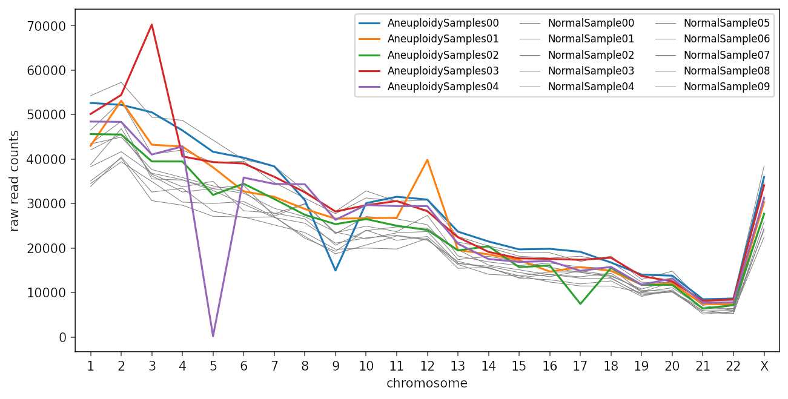
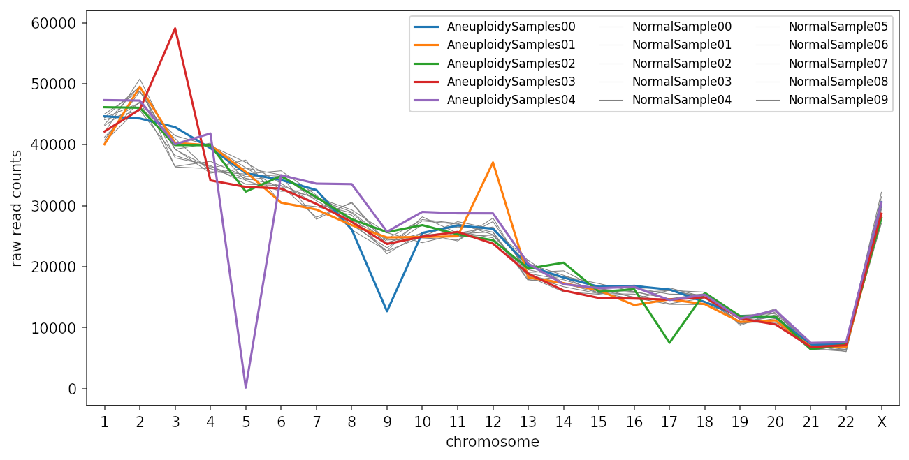
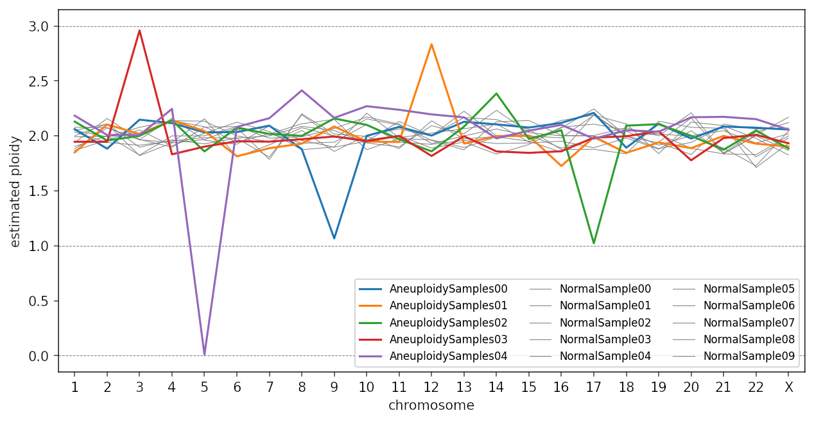
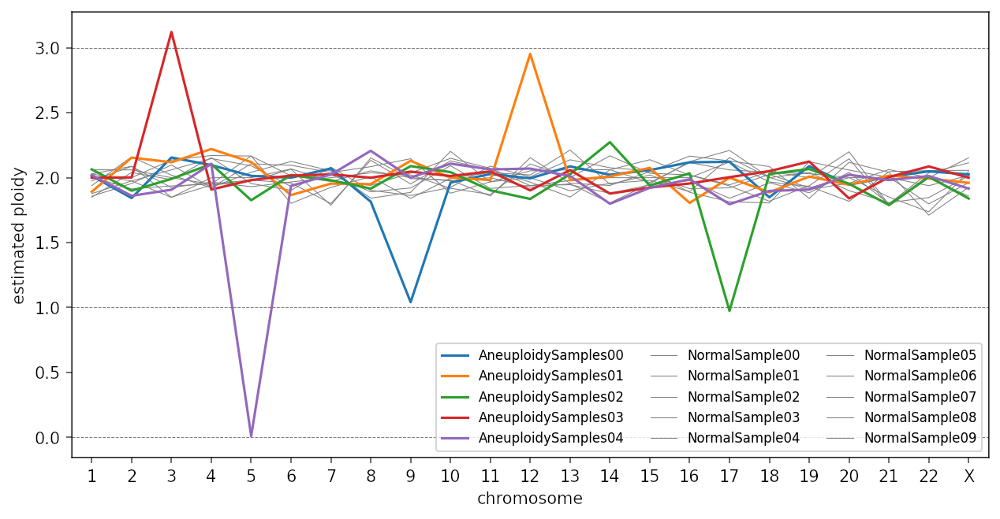

# Assignment 3: Structural Variants and Genome Graphs

### By Paul Wang and Chelsea Matthews

---

Data for this assignment is located in the `/data/assignment3/` directory

## Question 1: Aneuploidy and Copy Number Variations (15 marks)

In this question we will look at detecting aneuploidy and copy number variations (CNVs). The data used here are artificially generated data that mimic low-coverage whole genome sequencing (WGS) data.

The samples all have these features:
* based on human genome
* mapped to hg19 reference genome
* all samples are diploid baseline with XX (i.e. no Y chromosome)
* sample coverages are approximately 40-60 read-pairs per MB


### Question 1 Part 1: Counting reads (3 marks)

---

In the directory `data/assignment3/Q1` you should see several BAM files named as `AneuploidySamples0[0-4].bam`  and `NormalSample0[0-9].bam`

The "Normal" samples have 2 copies of each chromosome, while the "Aneuploidy" samples have at least one chromesome where the copy number is not 2.

You can use `samtools idxstat` to get the read counts for each contig. e.g.:

```
$ samtools idxstat AneuploidySamples00.bam
1	249250621	52614	0
2	243199373	52200	0
3	198022430	50520	0
4	191154276	46452	0
5	180915260	41634	0
6	171115067	40316	0
...
```

From `idxstat` documentation (http://www.htslib.org/doc/samtools-idxstats.html) the columns are:

* reference sequence name (chrom name)
* sequence length
* \# mapped read-segments 
* \# unmapped read-segments 

&nbsp;

Write a BASH script to generate a TSV table that contains the per-chromosome read counts for each sample. The table only needs to include chromosomes 1-22 and X. The output should look like:

```
chrom	AneuploidySamples00	AneuploidySamples01	AneuploidySamples02	AneuploidySamples03...
1	52614	42998	45616	50140
2	52200	53112	45522	54420
3	50520	43226	39474	70242
4	46452	42828	39457	40592
5	41634	38148	31942	39324
6	40316	32746	34466	39010
7	38370	31518	31037	36026
8	30757	28773	27471	32534
9	14949	26613	25372	28202
10	30090	26698	26507	29632
11	31526	26810	25020	30562
.
.
.
```

***Save the output as `A3Q1.read_counts.tsv`.***

***Include the script in your submission as `A3Q1.read_counts_script.sh`***


### Question 1 Part 2: Aneuploidy (5 marks)

(You can do the following using whatever software you like, e.g. Python, R or MS Excel).

If you plot the raw read counts for each sample, it should look something like this:



**[Figure 1a: unnormalised sample chromosome read counts]**

While there is probably enough information already to make educated guesses about the aneuploidies present in the samples, if we want to be certain, we need to normalise the samples first.

The simplest normalisation is to normalise each sample to have the same total read counts. 

a) ***Calculate the average total read counts per sample from the table.***

[1 mark]

b) ***Normalise the sample read counts such that the total read counts for each sample now adds up to the value from a).***

[1 mark]

If you plot the normalised data, you should see something like:



**[Figure 1b: Normalised sample chromosome read counts]**

Finally, we need to convert the normalised read counts to ploidy estimates.

c) ***Calculate the mean and median of the normalised read counts for each chromosome.***

[1 mark]

This should be the expected diploid normalised coverage depth for each chromosome. Discuss which of the mean or median you think is more appropriate to use.

***For each sample, divide the normalised read-count by the mean or average read-count, then multiple by 2. The resultant value is the estimated ploidy for the chromosome.***

Now if you plot the output, you should see something like:



**[Figure 1c: Estimated sample chromosome ploidy]**


***List the aneuploidy events.***


d) In the figure above (Fig. 1c), you can see that there are several points (e.g. `AneuploidySample04` chr5, `AneuploidySample02` chr14) that appear to be outliers but the ploidy estimates do not reach a full allele gain.

While it is possible to have mosaicism with aneuploidies (i.e. mixture of normal and aneuplodic cells) which can account for fractional gains and losses, in this case, these are actually just normalisation artefacts.

For example, if we look back to Fig. 1a, the loss of chr5 in `AneuploidySample04` would have significant impact if the normalisation was done over all chromosomes. Specifically, as it has fairly large contribution, it will push all other chromosome values higher. 

A quick way to adjust for this is to perform the normalisation by excluding chromosomes where aneuploidies are observed. 

***Apply the normalisation adjustment and submit a table (as TSV file) showing the adjusted ploidy estimates for each sample and chromosome. e.g.:***

```
 chrom  NormalSample00  NormalSample01  NormalSample02
     1        2.035612        2.049455        2.078700
     2        1.940069        1.991432        2.074721
     3        1.914444        2.026240        1.963962
     4        1.953722        2.138810        1.939936
     5        1.983816        2.083293        2.155639
```

[2 marks]

Plotting the adjusted ploidy estimates now should give you something like:



**[Figure 1d: Adjusted sample chromosome ploidy estimates]**

### Question 1 Part 3: Copy Number Variations (7 marks)

a) Rather than using the script in Part 1, you can generate the same coverage data (read counts per chromosome per sample) with a single command using `bedtools multicov`. 

Enter the command `bedtools multicov` to see how to use it to generate the coverage data:

```
$ bedtools multicov

Tool:    bedtools multicov (aka multiBamCov)
Version: v2.30.0
Summary: Counts sequence coverage for multiple bams at specific loci.

Usage:   bedtools multicov [OPTIONS] -bams aln.1.bam aln.2.bam ... aln.n.bam -bed <bed/gff/vcf>
```

You will need the chromosome sizes to create the BED file:

```
1	249250621
2	243199373
3	198022430
4	191154276
5	180915260
6	171115067
7	159138663
8	146364022
9	141213431
10	135534747
11	135006516
12	133851895
13	115169878
14	107349540
15	102531392
16	90354753
17	81195210
18	78077248
19	59128983
20	63025520
21	48129895
22	51304566
X	155270560
Y	59373566
MT	16569
```

***Submit the BED file you created and the command to generate the read counts data.***


b) In the directory `/data/assignment3/Q1/` you will see also a number of BAM files named `CNV_sample[1-10].bam`. This set of files includes both normal samples (with no CNVs) and samples with 1 or 2 CNVs. Some have large CNVs (~chromosome arm gain or loss), while others have smaller CNVs. The smallest CNV is 2MB.

(There are no fractional CNVs, i.e. all ploidy changes are integer values.)

***Generate appropriate read counts data and perform the normalisation steps as in Part 2, report CNV events.***

1. Generate a BED file with 1 MB intervals covering the entire genome.
2. Use `bedtools multicov` to generate read counts data
3. [OPTIONAL] perform read counts normalisation as per Part 2.
4. Report CNV calls in samples.


## Question 2 (13 marks)

This question uses the same data for both parts. In `/data/assignment3/Q2` you should find these files:

```
mappable_region.fasta
compound_mono_allele.bam
compound_mono_allele.bam.bai
structuralvariants.vg
```

Download these files. Launch IGV. 

1. Load `mappable_region.fasta` as the genome file ("Genomes" -> "Load Genome from File...")
2. Load `compound_mono_allele.bam` as the alignment data ("File" -> "Load from File...")

### Question 2 Part 1: Structural variations (5 marks)

**1.1** Locate and list any breakpoints you can see in the data.

[2 marks]

**1.2** Identify all SV events and their associated breakpoints. 
Show the steps and reasonings for your answers. Include diagrams if you think it helps. If you want to use hand-drawn diagram, just take and submit a photo of your drawing, but make it's clearly legible.

[3 marks]


### Question 2 Part 2: Graph genome (8 marks)

**Q2.1** You have been provided with a file called `structuralvariants.vg` in the assignment data folder that contains a graph constructed from the reference sequence you used for the first part of this question.
In addition to the path representing the reference sequence, there are an additional three paths through the graph representing three different haplotypes.

When you visualise this graph, keep in mind that this graph models structural variants which are much larger than the small variants we have been looking at in the practicals.
The principle is the same except that the nodes are larger.
Also note that, for ease of visualisation, the nodes in this graph are very large.

Visualise the graph using `vg view -dunp graph.vg | dot -Tpdf -o pdf_filename` and provide a screenshot of your visualisation.

[2 marks]

**Q2.2**	What do each of the four parameters provided to vg view do?

[2 marks]

**Q2.3**	Describe how each of the three paths (path_one, path_two, and path_three) through the graph vary from the reference sequence.
You may reference the node numbers from the graph you visualised to do this and should consider using terms such as "deletion", "insertion" and "inversion" in your explanation.
If a variant doesn't seem to fit into one of these categories, call it a complex variant and describe what is happening. 

Remember that the variants should be described in terms of what the reference sequence looks like 
For example, a deletion is where a haplotype does not have a sequence at a particular location that is present in the reference sequence at that location.


[3 marks] 

**Q2.4**	One of these paths represents the haplotype of the sample you saw in Question 2 Part 1.
This haplotype contains the structural variation that you identified.
Which path is it? 

[1 mark]

## Question 3 (12 marks)


You have been provided with a reference sequence `hippogryph.fasta` and the most common variants found in the hippogryph population in `hippogryph.vcf`.

If you don't know what a hippogryph is, it's a mythical creature with the body of a horse and the head and wings of an eagle. 

Your task is to genotype a newly sequenced sample (frayfeather) which will help to understand more about the phenotypic characteristics of frayfeather. 
Details of the observed links between genotype and phenotype can be found in the genotype_phenotype.txt file.
Note that the phenotype associated with both the reference (REF) allele and the alternate (ALT) allele are described. 

**Q3.1** Construct a pan-genome graph from this data using the reference sequence and the .vcf.
When constructing this graph, keep in mind that we will be using it for genotyping.
Visualise this graph in a format of your choice and screenshot the first part of the graph up to and including the first variant.
Any visual form is acceptable but you should also include the code that you used to create this visualisation.

[3 marks]

**Q3.2** Align the provided reads in `frayfeather.reads` to the graph. 
Report your alignment command and the average read mapping identity using `jq .identity`.
Would you expect this value to be higher or lower if the graph contained only the **least** common variants found in the hippogryph population. 

[2 marks]

**Q3.3** Genotype the frayfeather sample.

For which variants does frayfeather have the alternate allele?
Provide the variant ID for these variants from column 3 of the vcf.

Using the provided table (genotype_phenotype.txt) describing the phenotypes associated with each variant (for both the REF and ALT allele), list frayfeather's phenotypic characteristics associated with variants v1, v2, v3, and v4 (found in the ID column).
Note that the hippogryph has a haploid genome.

Comment on whether or not you think frayfeather would be a good choice for a long flight.

[4 marks]

**Q3.5** Conceptual - How can using a pan-genome graph reduce reference bias?

[2 mark]

**Q3.6** Conceptual - In transcriptomics experiments, we align reads generated from RNA to a reference genome and determine the read depth for each gene in the reference.
Greater read depth for a gene is equated with higher levels of expression than a gene with lower read depth. 
In this way, we can make an estimate of relative gene expression. 
This system relies on the assumption that reads are aligning equally well to all genes. 
How could using a pan-genome graph potentially increase the accuracy of this type of analysis?

[1 marks]

Total: 40 Marks

