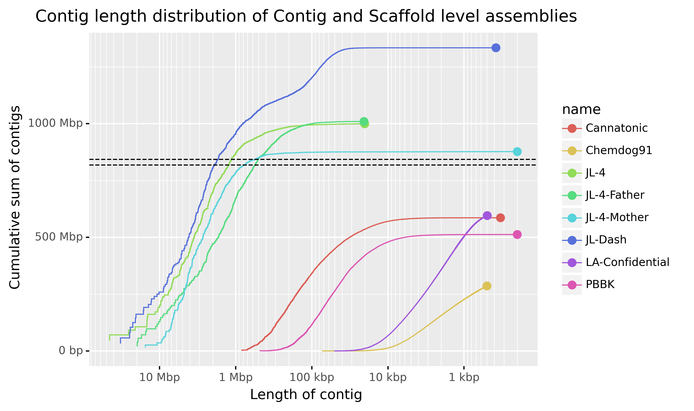

# Genome Assembly Practical: Part 2 
*By Zhipeng Qu and Chelsea Matthews*

This practical will continue on from the first session of Practical genome assembly. 

## Part 5, Assembly quality assessment

In the first session of this practical we assembled the fission yeast (*Schizosaccharomyces pombe*) genome using different input datasets. If you finished the genome assembly using four datasets respectively, you should have four draft genome assemblies:

- nanopore_LR_5x.assembly.fasta (the one that we assembled in last session).
- pacbio_LR_5x.assembly.fasta
- nanopore_LR_10x.assembly.fasta
- pacbio_LR_10x.assembly.fasta

Today we will look at measuring *de novo* assembly quality with a focus on reference free quality metrics. 
In particular we will look at contig length distributions and BUSCO. 

### 5.1. Setting up

If you finished genome assembly using all four datasets, you should get all four above-mentioned `*.assembly.fasta` files in corresponding Flye output folder in `~/prac_genome_assembly/04_results/03_genome_assembly`. You can use following commands to put them together in the same folder:

```bash
cd ~/prac_genome_assembly/04_results/03_genome_assembly
mkdir genomes

cp ./nanopore_LR_5x/assembly.fasta ./genomes/nanopore_LR_5x.assembly.fasta
cp ./pacbio_LR_5x/assembly.fasta ./genomes/pacbio_LR_5x.assembly.fasta
cp ./nanopore_LR_10x/assembly.fasta ./genomes/nanopore_LR_10x.assembly.fasta
cp ./pacbio_LR_10x/assembly.fasta ./genomes/pacbio_LR_10x.assembly.fasta
```

If you didn't finish genome assembly using all four datasets, that's fine. I have put all four assembled draft genomes in the folder `~/data/prac_genome_assembly/04_results/03_genome_assembly/genomes/`, You can get all these four files according to following commands: 

```bash
cd ~/prac_genome_assembly/04_results/03_genome_assembly
mkdir genomes

cp ~/data/prac_genome_assembly/04_results/03_genome_assembly/genomes/nanopore_LR_5x.assembly.fasta ./genomes
cp ~/data/prac_genome_assembly/04_results/03_genome_assembly/genomes/pacbio_LR_5x.assembly.fasta ./genomes
cp ~/data/prac_genome_assembly/04_results/03_genome_assembly/genomes/nanopore_LR_10x.assembly.fasta ./genomes
cp ~/data/prac_genome_assembly/04_results/03_genome_assembly/genomes/pacbio_LR_10x.assembly.fasta ./genomes
```

We will assess the quality of these four assembled genomes using QUAST and BUSCO, and hope after that, we can decide which one is the **best** assembled genome.

### 5.2 QUAST

**Important**: Before you run `quast`, remember to check your conda environment, if you are not in `bioinf` environment, run:

```bash
source activate bioinf
```

#### 1) run QUAST without reference

The tool QUAST (QUality ASsesment Tool) [documentation here](http://quast.sourceforge.net/docs/manual.html) can be run on one or more assemblies at once and produces some handy comparison statistics and graphics.
It can be run with or without a reference genome. 
If we provide a reference genome, each of the assemblies will be compared to this reference and QUAST will produce some additional statistics. 

Here we will run it first without a reference.

```bash
cd ~/prac_genome_assembly/04_results/04_genome_assessment

quast -o quast_without_reference -t 2 \
  --labels "nanopore_LR_5x, pacbio_LR_5x, nanopore_LR_10x, pacbio_LR_10x" \
  ~/prac_genome_assembly/04_results/03_genome_assembly/genomes/nanopore_LR_5x.assembly.fasta \
  ~/prac_genome_assembly/04_results/03_genome_assembly/genomes/pacbio_LR_5x.assembly.fasta \
  ~/prac_genome_assembly/04_results/03_genome_assembly/genomes/nanopore_LR_10x.assembly.fasta \
  ~/prac_genome_assembly/04_results/03_genome_assembly/genomes/pacbio_LR_10x.assembly.fasta

```

This won't take very long (< 1 min).

Open the `icarus.html` file located in the `quast_without_reference` directory in a web browser. 

Click on the QUAST Report link and have a look at the metrics produced by QUAST for each of the four assemblies. 

* *Based on the N50 and N75 scores, which is the best assembly?*

You've previously learnt about N50 as a measure of assembly contiguity ([refresh your memory here](https://en.wikipedia.org/wiki/N50,_L50,_and_related_statistics#N50)) but N50 on its own only gives us a snapshot into assembly contiguity.
A better way to look at assembly contiguity is to inspect a cumulative contig length plot.
This is particularly helpful when we want to compare multiple different assemblies of the same genome or species. 

Scroll down and inspect the Cumulative Length plot. Look at the Nx plot and GC Content plots too while you're there. 

* *Given that the fission yeast genome should be about 13Mbp long, which assembly do you think looks the best based on the contig length distributions?*
* *Spend some time interpreting the cumulative length plot. Under what circumstances would a cumulative length plot be more informative than just comparing N50s?*
* *What would an assembly with only one contig look like on this plot?*

The image below is a slightly different version of a cumulative contig length plot. 
The assemblies represented are publicly available cannabis assemblies (You can get more information about these genome assemblies from this [link](https://www.ncbi.nlm.nih.gov/datasets/genome/?taxon=3483) from NCBI genome). 
The dashed horizontal lines are the approximate sizes of the male and female genomes with the male being the longer.
Inspect the plot and answer the questions below. 



* *What benefit is there to having contig length on the x axis instead of the contig number in size order as in the QUAST plot?*
* *Two of these assemblies were generated from short reads. Which do you think they are?*
* *Can you tell which are contig level assemblies and which are scaffolded?*

Now let's have a look at the Icarus contig size viewer. 

Click on the "View in Icarus contig browser" link at the top of the page. 

This isn't really new information but it can be nice to visually see the lengths of our contigs. 

It's also a nice way to see the N50 and N75 values distributed on a visual representation of the assembly contigs. 

* *Based on what you've seen in the QUAST report, which assembly do you think looks the best?*

#### 2) run QUAST with a reference

We don't always have a reference genome available for a species but in this case, we do. 

We will now run QUAST on our four assemblies but will provide the reference genome this time. 

```
cd ~/prac_genome_assembly/04_results/04_genome_assessment

quast -o quast_with_reference -t 2 \
  -r ~/prac_genome_assembly/02_DB/GCF_000002945.1_ASM294v2_genomic.fna \
  --labels "nanopore_LR_5x, pacbio_LR_5x, nanopore_LR_10x, pacbio_LR_10x" \
  ~/prac_genome_assembly/04_results/03_genome_assembly/genomes/nanopore_LR_5x.assembly.fasta \
  ~/prac_genome_assembly/04_results/03_genome_assembly/genomes/pacbio_LR_5x.assembly.fasta \
  ~/prac_genome_assembly/04_results/03_genome_assembly/genomes/nanopore_LR_10x.assembly.fasta \
  ~/prac_genome_assembly/04_results/03_genome_assembly/genomes/pacbio_LR_10x.assembly.fasta
```

Again examine the `icarus.html` file in the `quest_with_reference` directory. 
Don't forget to click the "Extended report" link in the QUAST report. 
Have a good look through the new information and try to understand it. 

* *When interpreting the [misassemblies](https://quast.sourceforge.net/docs/manual.html#sec3.1.2) and mismatches sections in the QUAST report, what do you think we might need to keep in mind?*

### 5.3 BUSCO (Benchmarking Universal Single Copy Orthologs)

**Important**: BUSCO is installed in `busco` conda environment in VM. You need to activate this environment before we run the BUSCO commands. If you just finished `quast`, you should be in `bioinf` environment, you can run following commands to switch to `busco` conda environment:

```bash
source activate busco
```

BUSCO is a tool that helps us measure how well we have assembled the gene space of an assembly. 
It does this by searching our assembly for a list of genes that should be present in our assembly in a single copy. 
These genes are known as "Universal Single Copy Orthologs" and are genes that are present in at least 90% of the species/clade members and are only present in a single copy within at least 90% of the species/clade.
It is essentially a list of genes that we are almost certain should be present within our genome once.

Obviously this list of genes is different for different species/clades and so BUSCO has a list of datasets that we can choose from. 

Have a look at this list using the command below. 

```
busco --list-datasets
```

Before we run BUSCO, we need to decide which lineage dataset we should use for our assembled species. Get some ideas about the taxonomy of your assembled species is always a good starting point. For example, for fission yeast, we can get its taxonomy from [NCBI taxonomy browser](https://www.ncbi.nlm.nih.gov/Taxonomy/Browser/wwwtax.cgi?id=4896). Compare the taxonomy with the above listed available BUSCO linerage datasets, we can find that there are three datasets we should be able to use for fission yeast, which are `eukaryota_odb10`, `fungi_odb10` and `ascomycota_odb10` following the taxonomy tree.

The differences for these datasets are that datasets closer to the branch end of taxonomy will contain single copy orthologs that are more specific to the target species.

* *Do you think that the `ascomycota_odb10` database will have more or less single copy orthologs than the generic `eukaryota_odb10` database?*

You can see the number of universal single copy orthologs in each BUSCO database at [this](https://busco-archive.ezlab.org/data/lineages/) website. 

Check to see if you were right. 

Generally speaking, you should choose the lineage dataset closer to the branch end of taxonomy. But in this prac, choosing `ascomycota_odb10` will take much longer time to run than choosing `eukaryota_odb10` (Because there are much more orthologs in the `ascomycota_odb10`), therefore, we will use `eukaryota_odb10`.

Let's run BUSCO on our assemblies. First, we will run BUSCO on `pacbio_LR_10x.assembly.fasta`.

```
cd ~/prac_genome_assembly/04_results/04_genome_assessment

busco -m genome \
-i ~/prac_genome_assembly/04_results/03_genome_assembly/genomes/pacbio_LR_10x.assembly.fasta \
-o busco_pacbio_LR_10x \
-f -c 2 \
-l eukaryota_odb10

```

This will still take ~10 mins to finish. When the job is finished, you should get output printing to the terminal that includes something similar to the following. 

```
        --------------------------------------------------
        |Results from dataset eukaryota_odb10             |
        --------------------------------------------------
        |C:94.9%[S:92.9%,D:2.0%],F:2.0%,M:3.1%,n:255      |
        |242    Complete BUSCOs (C)                       |
        |237    Complete and single-copy BUSCOs (S)       |
        |5      Complete and duplicated BUSCOs (D)        |
        |5      Fragmented BUSCOs (F)                     |
        |8      Missing BUSCOs (M)                        |
        |255    Total BUSCO groups searched               |
        --------------------------------------------------
```

These results are also stored in the `short_summary*.txt` file in `busco_pacbio_LR_10x` directory. 

**NOTE** we won't run this chunk of code in the class due to time limitation. You can run BUSCO on other assemblies after the prac if you want by following commands:

```
cd ~/prac_genome_assembly/04_results/04_genome_assessment

busco -m genome \
-i ~/prac_genome_assembly/04_results/03_genome_assembly/genomes/nanopore_LR_5x.assembly.fasta \
-o busco_nanopore_LR_5x \
-f -c 2 \
-l eukaryota_odb10

busco -m genome \
-i ~/prac_genome_assembly/04_results/03_genome_assembly/genomes/pacbio_LR_5x.assembly.fasta \
-o busco_pacbio_LR_5x \
-f -c 2 \
-l eukaryota_odb10

busco -m genome \
-i ~/prac_genome_assembly/04_results/03_genome_assembly/genomes/nanopore_LR_10x.assembly.fasta \
-o busco_nanopore_LR_10x \
-f -c 2 \
-l eukaryota_odb10
```

Now let's visualise the results. 

We will use the `generate_plot.py` script that is usually installed with BUSCO. 

This script requires that all of the BUSCO short summaries be placed into a single folder. I have put BUSCO short summaries from 4 assemblies into folder `~/data/prac_genome_assembly/04_results/04_genome_assessment/busco_summaries`, so that you can directly use them with following commands: 

```bash
cd ~/prac_genome_assembly/04_results/04_genome_assessment

mkdir busco_summaries
cp ~/data/prac_genome_assembly/04_results/04_genome_assessment/busco_summaries/short_summary.*.txt ./busco_summaries
```

However, in your future projects, you should copy those short summaries from each individual BUSCO output folder. For example, for the 4 assemblies in this prac, the commands should look like this:

```bash
cd ~/prac_genome_assembly/04_results/04_genome_assessment
mkdir busco_summaries

cp ~/prac_genome_assembly/04_results/04_genome_assessment/busco_nanopore_LR_5x/short_summary.*.txt ./busco_summaries
cp ~/prac_genome_assembly/04_results/04_genome_assessment/busco_pacbio_LR_5x/short_summary.*.txt ./busco_summaries
cp ~/prac_genome_assembly/04_results/04_genome_assessment/busco_nanopore_LR_10x/short_summary.*.txt ./busco_summaries
cp ~/prac_genome_assembly/04_results/04_genome_assessment/busco_pacbio_LR_10x/short_summary.*.txt ./busco_summaries
```

Do a quick check in the `busco_summaries` folders to check that there are four files named like below:

`short_summary.specific.eukaryota_odb10.xxx.txt`

Now, go back to the Terminal window and run the python script. The command below should do the trick. 

```
cd ~/prac_genome_assembly/04_results/04_genome_assessment

generate_plot.py -wd ./busco_summaries
``` 

If all goes well, this should produce a `busco_figure.png` in the `all_summaries` directory. 

Navigate to it and open the png. 

* *Which assembly is the best according to the BUSCO metrics? Why?*
* *S. pombe has a haploid genome but there are duplicated genes present in the assembly. What do you think this means?* 

* *Based on the BUSCO results, and excluding the reference assembly, which assembly do you think looks the best?*

### 5.4. A quick example showing the application of the assembled genome: variant calling

With the denovo assembled genome, there are a few different genomics analysis that we can do, such as identifing genes/proteins that of our interests, comparing with another genome, or detecting variants between our assembled genome and other individuals of the same species (such as different strains of S. pombe). Next we will use above assembled genome to detect variants based on sequencing from two other strains of *S. pombe*.

First, we will need to align the DNA sequencing reads (Illumina) from two other strains to the assembled genome (we will be using assembled genome with 10x pacbio reads in this example). This will be a good chance for you to practice what you have learned in previous Pracs [`Read Quality Control`](https://university-of-adelaide-bx-masters.github.io/BIOINF-3010-7150/Practicals/Read_QC/read-qc.html) and [`Short and Long Read Alignment`](https://university-of-adelaide-bx-masters.github.io/BIOINF-3010-7150/Practicals/short_long_alignment/short_long_alignment.html).


You can copy the DNA sequencing reads for the other two strains using following commands.
```
cd ~/prac_genome_assembly/03_raw_data
cp ~/data/prac_genome_assembly/03_raw_data/SRR*.fastq.gz ./
```

And then, we need to do QC for these raw sequencing reads, and also remove adaptor and low-quality sequences.
```
source activate bioinf

mkdir ~/prac_genome_assembly/04_results/05_variant_calling

cd ~/prac_genome_assembly/04_results/05_variant_calling

# QC of raw reads
fastqc -o ~/prac_genome_assembly/04_results/05_variant_calling \
  ~/prac_genome_assembly/03_raw_data/SRR26143067_R1.100x.fastq.gz \
  ~/prac_genome_assembly/03_raw_data/SRR26143067_R2.100x.fastq.gz \
  ~/prac_genome_assembly/03_raw_data/SRR26143068_R1.100x.fastq.gz \
  ~/prac_genome_assembly/03_raw_data/SRR26143068_R2.100x.fastq.gz

trimmomatic PE ~/prac_genome_assembly/03_raw_data/SRR26143067_R1.100x.fastq.gz \
  ~/prac_genome_assembly/03_raw_data/SRR26143067_R2.100x.fastq.gz \
  SRR26143067_R1.100x.clean.fastq.gz SRR26143067_R1.100x.orphans.fastq.gz \
  SRR26143067_R2.100x.clean.fastq.gz SRR26143067_R2.100x.orphans.fastq.gz \
  ILLUMINACLIP:${CONDA_PREFIX}/share/trimmomatic/adapters/TruSeq3-PE.fa:2:30:10:3:true \
  SLIDINGWINDOW:4:10

trimmomatic PE ~/prac_genome_assembly/03_raw_data/SRR26143068_R1.100x.fastq.gz \
  ~/prac_genome_assembly/03_raw_data/SRR26143068_R2.100x.fastq.gz \
  SRR26143068_R1.100x.clean.fastq.gz SRR26143068_R1.100x.orphans.fastq.gz \
  SRR26143068_R2.100x.clean.fastq.gz SRR26143068_R2.100x.orphans.fastq.gz \
  ILLUMINACLIP:${CONDA_PREFIX}/share/trimmomatic/adapters/TruSeq3-PE.fa:2:30:10:3:true \
  SLIDINGWINDOW:4:10

fastqc *.clean.fastq.gz
```

We will be using BWA to map these DNA sequencing reads to our assembled genome.
```
cd ~/prac_genome_assembly/04_results/05_variant_calling

# genome mapping using BWA
bwa index ~/prac_genome_assembly/04_results/03_genome_assembly/pacbio_LR_10x/assembly.fasta

bwa mem ~/prac_genome_assembly/04_results/03_genome_assembly/pacbio_LR_10x/assembly.fasta \
  SRR26143067_R1.100x.clean.fastq.gz SRR26143067_R2.100x.clean.fastq.gz \
  | samtools view -F 4 -u \
  | samtools sort \
  -o SRR26143067.bam \
  /dev/stdin

bwa mem ~/prac_genome_assembly/04_results/03_genome_assembly/pacbio_LR_10x/assembly.fasta \
  SRR26143068_R1.100x.clean.fastq.gz SRR26143068_R2.100x.clean.fastq.gz \
  | samtools view -F 4 -u \
  | samtools sort \
  -o SRR26143068.bam \
  /dev/stdin
``` 

Then we can use [`bcftools`](https://samtools.github.io/bcftools/howtos/index.html) to call variants. You will learn more about variants and VCF format files in following lectures and Pracs.

```
cd ~/prac_genome_assembly/04_results/05_variant_calling

bcftools mpileup -f ~/prac_genome_assembly/04_results/03_genome_assembly/pacbio_LR_10x/assembly.fasta \
    SRR26143067.bam \
    SRR26143068.bam |
    bcftools call -mv |
    bcftools view -O z -o variants.vcf.gz  
```
We can get some statistics about the detected variants using `bcftools stats`.

```
cd ~/prac_genome_assembly/04_results/05_variant_calling

bcftools stats variants.vcf.gz >variants.summary.txt

```

We can also filter the variants based on different criteria. For example, we can keep variants with supporting read depth more than 100 (`DP > 100`) and quality score higher than 100 (`QUAL > 100`) (**Note: This is just a toy example showing you how to do variant filtering, and you will need to choose your filtering criteria carefully when you are doing a real-world project.** Please refer to the [documentation](https://samtools.github.io/bcftools/howtos/filtering.html) to get more information about variant fitlering). 

```
cd ~/prac_genome_assembly/04_results/05_variant_calling

bcftools filter -i 'DP>100 && QUAL>100' variants.vcf.gz \
    -O z -o variants.filtered.vcf.gz  
    
bcftools stats variants.filtered.vcf.gz >variants.filtered.summary.txt
```

After we get the filtered variants, we can do some additional analysis based on these variants, for example, we can use `vg` to build genome graph, which you will learn in next lecture/pracs.

