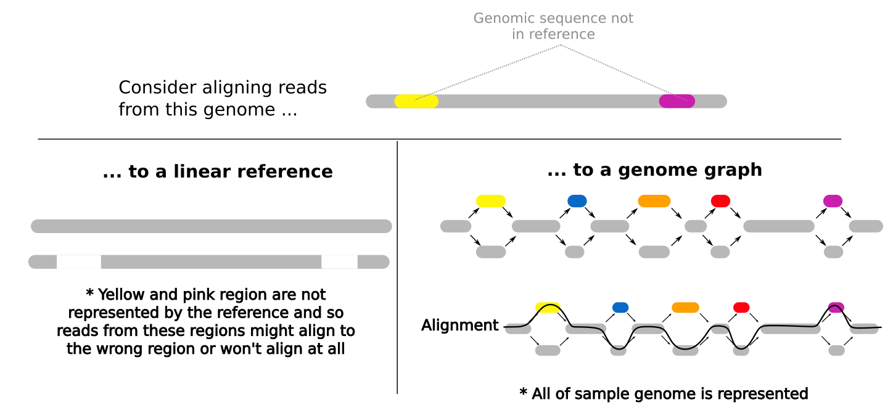
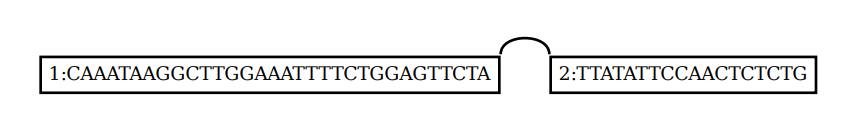
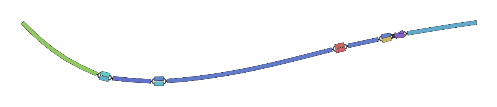
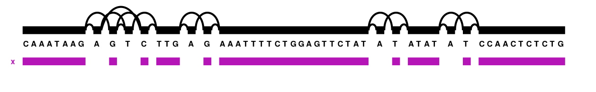
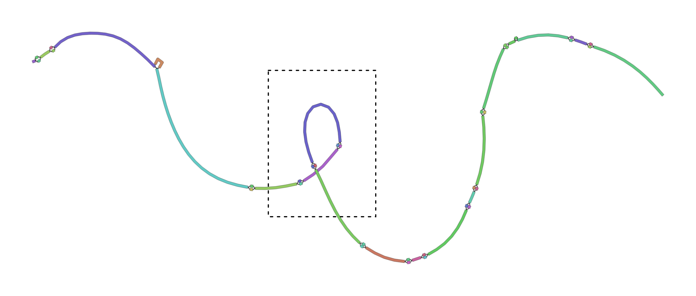

# Graph Genomes Practical: Part 1

##### _By Chelsea Matthews - Adapted from Yassine Souilmi_

# Background

Many bioinformatics analyses begin by aligning reads to a linear reference genome and you've done this in earlier practicals. 
Reads are aligned to the reference based on the similarity of their sequence to the reference sequence.
This means that if a newly sequenced genome has a genomic sequence that is very different to the reference genome for that species, reads that originate from these different regions may not align to the reference genome or might align to the wrong region of the reference genome.
When a read doesn't align at all, it is often discarded and so we lose some information about the newly sequenced sample genome.
Similarly, when a read incorrectly aligns, we falsely interpret what the newly sequenced genome looks like.
This bias in an analysis is called _reference bias_ and it can have a significant impact on our findings. 

Pan-genomes, and in this case, pan-genome graphs help to reduce reference bias. 
Instead of representing one possible genome for that species (eg. the E. coli reference you used in an earlier practical) genome graphs represent multiple possibilities for that species genome.
This means that when we align reads to the genome graph, reads are more likely to be similar to a sequence represented within the graph and so alignment rates and alignment accuracy are better.



**Note:**
Bioinformatics methods where we align reads to a linear reference genome (like the E. coli reference you used in an earlier practical) are cheaper and simpler than building and using a genome graph and these linear reference-based methods are very well documented and tested. 
The methods and software for building and using genome graphs are still under development.
For these reasons, linear reference genomes are currently far more commonly used than graph-based approaches but this may change in the near future.

# Get started!

Todays practical is broken into 5 sections. 

- Part 1: Build a small variant graph pangenome
- Part 2: Learn to visualise it
- Part 3: Align reads to the pangenome and visualise them
- Part 4: Build a pangenome using the Multiple Sequence Alignment method
- Part 5: Build an MSA pangenome graph for Cannabis


Let's activate the `bioinf` environment and check if our software is working.  


```
source activate bioinf
```

This includes all of the tools we'll be using today.

- vg - for constructing genome graphs

- graphviz - graph visualisation software

- Bandage - graph visualisation software

The following commands should each display some usage instructions for each tool

```
vg
Bandage --help
dot --help #dot is part of the graphviz package
```

Now create directories and copy the data over to your working directory:

```
cd ~
mkdir -p GraphGenomes/{variant,msa,mygraph}
mkdir -p GraphGenomes/variant/visualise
cp /shared/data/Graph_Genomes/prac1/tiny* ~/GraphGenomes/variant/.
cp /shared/data/Graph_Genomes/prac1/HLA_haplotypes.fa ~/GraphGenomes/msa/.
cp /shared/data/Graph_Genomes/prac1/{mystery.fq,cannabis.fasta} ~/GraphGenomes/mygraph/.
```

# Part 1: Build a Variant Graph Pangenome

Here we will build two very small graphs. The first will be made up of just the reference sequence and the second will include variants from a population which will be our first pangenome graph. 

```
cd ~/GraphGenomes/variant
```

You should have the following two files in `~/GraphGenomes/variant`.

- tiny.fa
- tiny.vcf.gz

### Have a look at the data

We have two files. The first, `tiny.fa`, is the reference sequence for our pangenome. 
Take a look at it. 

```
cat tiny.fa
```

- What is the name of the sequence? 
- How long is it? 
- When might it be a bad idea to use the `cat` command on a fasta file?

The second file is a VCF. 

VCF stands for "Variant Call Format".
VCF files describe genomic variants including:
- the variant location within the reference genome
- the genomic sequence of the reference allele at that location
- the genomic sequence of the variant

Small variants like SNPs, insertions, and deletions are commonly documented in VCFs but larger structural variants like duplications and inversions may also be included. 
These variants can come from one sample or from many members of a population.

Let's have a look.

```
gunzip tiny.vcf.gz
cat tiny.vcf
```

- How many variants are in this VCF?
- What information do the first 5 columns of the VCF contain?
- What kind of variants does the VCF contain?

That's all we need to build our pangenome! 

### Build a graph with just the reference sequence

First we will be building a graph with just the reference sequence. 

```
vg construct -r tiny.fa -m 32 > ref.vg
```

The `.vg` format isn't readable for humans so we'll convert it into GFA format so that we can have a look. 

GFA stands for Graphical Fragment Assembly.

GFA format has a header line that begins with `H`.
Lines beginning with `S` are segments (or **nodes**) of the graph.
Lines beginning with `L` are links (or **edges**) and lines beginning with `P` are **paths** through the graph.
A path through a graph represents an observed biological sequence or haplotype and a single graph can have many paths. 

```
vg view ref.vg
```

#### Questions:

- How many nodes does this graph have?
- How many edges does this graph have?
- How many paths does this graph have?
- What does the `-m` option do in `vg construct`? 


While GFA format is human readable, it's more intuitive to look at graphs with nodes and edges displayed visually.

```
vg view -dp ref.vg | dot -Tpdf -o visualise/ref_dot.pdf
```

It's a graph, but not a very exciting or useful one. 
Before we continue looking at visualisation options, let's build a graph with some variation in it. 

### Build a graph with variation

Build a variation graph using the command below and then have a look at it in GFA format.

```
vg construct -r tiny.fa -v tiny.vcf -m 32 > tiny.vg
vg view tiny.vg > tiny.gfa
```

Have a look at the `tiny.gfa` file. 

- How many nodes, edges, and paths does this graph have?

# Part 2: Graph Visualisation

We have a number of options when it comes to visualisation. 

### Option 1 - dot from the Graphviz package



```
vg view -dp tiny.vg | dot -tpdf -o visualise/tiny_dot.pdf 
```

- What do the `-d`, `-p`, `-S`, and `-n` options do in the `vg view` command? 

### Option 2 - Bandage



For larger graphs, `Bandage` is sometimes a better solution.
It was designed for visualising assembly graphs (these are the graph structures that are made by assembly tools during *de novo* genome assembly).
Bandage can't display path information but it does allow us to visualise the structure of graphs that are many Megabases in size.
The Bandage GUI is quite interactive allowing us to zoom in on regions of graphs and extract sequences of interest for further analysis. 
We only have access to the command line version so it's not quite as interactive. 

Bandage requires the graph to be in .gfa format which we already created in Part 1.

```
Bandage image tiny.gfa visualise/tiny_bandage.png
```

**Note:** Your Bandage graph will come out slightly differently each time you run it and sometimes will have loops that don't actually represent variation.
You can tell this by the way the nodes continue through the intersection point and no edges are displayed.
You can see an example of this in the bandage plot figure shown in Part 4.  
Feel free to re-run bandage to get a plot that you like. 

#### Option 3 - vg viz



`vg viz` produces a linear layout of a graph that scales well between small and larger graphs without losing path information.
Unfortunately, it doesn't seem possible to view .svg files from within our R-studio machines.
To get around this, you will need to download the .svg fle to your local machine.

`vg viz` requires the .xg index of the graph you want to visualise. 

```
vg index -x tiny.xg tiny.vg

vg viz -x tiny.xg -o visualise/tiny_viz.svg
```

# Part 3: Align reads to the graph

Now we've built a graph and looked at it but we haven't done anything with it yet. 

It would be useful if we could align reads to the graphs as this is often a first step in many bioinformatics analyses. 

Mapping reads to a graph is done in two stages: first, seed hits are identified and then a sequence-to-graph alignment is performed for each individual read.
Seed finding allows vg to spot candidate regions in the graph to which a given read can potentially map to.

To do this, vg requires two indexes, an XG index and a GCSA index.
We already have the xg index so we'll make the gcsa index next. 

```
vg index -g tiny.gcsa -k 16 tiny.vg
```

We don't have any reads for our data so we'll use vg to simulate some using `vg sim` as below. 

```
cd ~/GraphGenomes/variant
mkdir reads

# generate three reads and then have a look at them
vg sim -l 20 -n 3 -e 0.05 -i 0.02 -x tiny.xg tiny.vg -a | vg view -X - > reads/sim_reads.fq
```

- What do the parameters in the `vg sim` command do? 

Now we will map these three reads to our graph. 
When it comes to mapping in `vg`, we have three options. 

`vg giraffe` is designed to be fast for highly accurate short reads, against graphs with haplotype information.

`vg map` is a general-purpose read mapper.

`vg mpmap` does "multi-path" mapping, to allow describing local alignment uncertainty. This is very useful for transcriptomics. Why might that be?

We will be using `vg map`.


```
vg map --fastq reads/sim_reads.fq -x tiny.xg -g tiny.gcsa > tiny.gam
```

Let's re-visualise to see the alignments. 
Notice that the `vg view` command below uses the `-S` option to simplify the dot output.

```
vg view -dS tiny.vg -A tiny.gam | dot -Tpdf -o visualise/alignment.pdf
```

- Why does your graph look different to mine and/or your neighbours?
- Did all three of your sequences align?
- What do you think the different colours of the nodes indicate?

Feel free to try it without the `-S` option as well as any other parameter combos you like to see the difference. 

Looking at the reads of a graph can be quite overwhelming when you've got a lot of alignments and so it can sometimes help your visualisation to add these alignments back into the graph as paths, in the same way as we have the reference path.

```
vg augment --label-paths tiny.vg tiny.gam > augmented.vg
```

Let's take a look at the graph with the dot output format as well as with `vg viz`

```
vg view -dp augmented.vg | dot -Tpdf -o visualise/augmented_dot.pdf 

vg index -x augmented.xg augmented.vg
vg viz -x augmented.xg -o visualise/augmented_viz.svg
```

Note that this path information doesn't include the quality of the mapping, it just tells you where the best alignment was. 

Next practical we'll look at doing more with our read alignments (calling variants, embedding variants back into the graph). 


# Part 4:  Multiple Sequence Alignment graph

We can also build pangenome graphs using Multiple Sequence Alignment. 
This method is often used when we have a number of high quality haplotype-resolved assemblies available.
We align the haplotype sequences with each other to see where each of the sequences is similar and where they differ. 

```
cd ~/GraphGenomes/msa
```

The HLA (Human Leukocyte Antigen) is a set of genes located on Chromosome 6 that encode for proteins used by the immune system to tell whether a cell belongs to the body or not (eg, infection, cancer, transplants). 
HLA typing is where we identify the specific alleles of a persons HLA genes. 
This information is commonly used for determining the best match for organ transplants. 
When the HLA alleles of a patient are more similar to the HLA alleles of their organ donor, the patient is much less likely to reject the organ. 
We'll be building a pangenome graph from a small number of haplotypes from the Human Leukocyte Antigen complex located on chromosome 6.

Take a look at the `HLA_haplotypes.fa` file. 

- What does it contain? 
- How many sequences are there? 

We will build the graph with `vg msga` and `vg mod` and then we will index it. 
Don't panic when it prints warnings. This is because the `vg msga` module is not strictly the recommended way to produce multiple sequence alignments but we don't have the software on our machines for other methods and `vg msga` works for our purposes. 

```
vg msga -f HLA_haplotypes.fa -t 2 -k 16 | vg mod -U 10 - | vg mod -c -X 256 - > hla.vg
vg index hla.vg -x hla.xg -g hla.gcsa
```

- What do each of the three steps in the first command above do? 

And visualise again! 

```
vg view hla.vg > hla.gfa

Bandage image hla.gfa hla.png
vg view -dp hla.vg | dot -Tpdf -o hla.pdf
vg viz -x hla.xg -o hla.svg
```

Your bandage plot should look something like the plot below. Note that this plot has a loop that doesn't indicate genomic variation.
Rather, the loop inside of the dashed square is just a result of the random way that bandage visualises the graph. 



- What do these plots tell you about the variability of this small section of the HLA complex?
- Do you find some of these visualisation methods more useful than others? 

# Part 5: Your turn!

The `mygraph` directory contains a fasta file containing four assembled haplotypes from a single region of the Cannabis genome.  

Build a multiple sequence alignment graph from the cannabis.fasta dataset in the `~/GraphGenomes/mygraph` directory. 
Consider the first sequence in the fasta file the reference sequence (see if you can find a way to specify this in the `vg msga` help menu).

Try to do/answer the following: 
 
- Visualise your graph in a few different ways. 
- What is the major difference between each of the three samples compared with the `pink_pepper` reference. One sequence has a duplication, one has a deletion, and one has an insertion. Which cannabis haplotype has which structural variant? There are also other small differences between the haplotypes but these are not the focus. 
- Just for fun, change the colour of your Bandage plot. Check out `Bandage image --helpall` to work out how.   
- Align the supplied reads in `mystery.fq` to your graph and work out which type of cannabis they are most similar to. 

##### Hints/Handy tips

To visualise just a small part of the graph, we can subset the graph using `vg find`.
The `-n 349` refers to the node number you're interested in and the `-c 10` is node context, the number of nodes either side of your node of interest that will be included. 

```
# NOTE: This is example code! You'll need to modify it to make it work.
vg find -n 349 -x in.xg -c 10 | vg view -dp - | dot -Tpdf -o out.pdf
```

You can do the same thing using Bandage without directly subsetting the graph.
The `--nodes` parameter is the number of the node you're interested in and the `--distance` parameter is the number of nodes each side to include. 


```
# NOTE: Example code only.
Bandage image in.gfa out.png --scope aroundnodes --nodes 349 --distance 10
```

