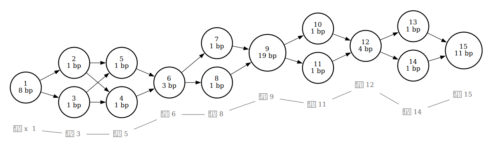

# BIOINF 3010 & 7150⋅

## Graph Genomes Week 8 Practical 1

## Chelsea Matthews

### 1. Background⋅

Many bioinformatics analyses begin by aligning reads to a linear reference genome.
This alignment step is what you did in an earlier practical when you aligned Illumina reads and PacBio reads to an E. coli reference.
Reads are aligned to the reference based on the similarity of their sequence to the reference sequence.
This means that if a newly sequenced genome has a genomic sequence that is very different to the reference genome for that species, reads that originate from these different regions may not align to the reference genome or might align to the wrong region of the reference genome.
When a read doesn't align at all, it is often discarded and so we lose some information about the newly sequenced sample genome.
Similarly, when a read incorrectly aligns, we falsely interpret what the newly sequenced genome looks like.

And that brings us to the point of a genome graph.
Instead of representing one possible genome for that species (eg. the E. coli reference you used) genome graphs represent multiple possibilities for that species genome.⋅
This means that when we align reads to the genome graph, reads are more likely to be similar to a sequence represented within the graph and so alignment rates and alignment accuracy are better.

Put simply, genome graphs have the ability to reduce bias in our analyses.


**Note:**
Bioinformatics methods using a linear reference genome (like the E. coli reference you used) are much cheaper and simpler than genome graph approaches which is why they are far more commonly used.⋅
In addition, the methods surrounding the use of genome graphs in different types of analyses are still under development.⋅

### Loading Packages

First you will need to load the required tools.

```
source activate bioinf
```

This includes all of the tools we'll be using today.

- vg - for constructing genome graphs

- graphviz - graph visualisation software

- Bandage - graph visualisation software

The following commands should each display some usage instructions for each tool

```
vg
Bandage --help
dot --help #dot is part of the graphviz package
```

## Getting Data

Copy the following files:

```
mkdir graph_1
cp data/graph_genomes/prac1/* graph_1/
cd graph_1
```

Check that you have the following files in `graph_1`

```
tiny.fa
tiny.fa.fai
tiny.vcf.gz
tiny.vcf.gz.tbi
```

## Building your first graph

Our first graph will be constructed from a single sequence that we can find in the `tiny.fa` file.
Let's have a look at it.

```
cat tiny.fa
```

:question: What is the name of the sequence and how long is it?

Hopefully you remember that a graph is composed of a number of nodes that are joined together by edges.⋅
We will be using vg to construct the graph.
To build the graph, use the following command:

```
vg construct -r tiny.fa -m 32 > tiny.ref.vg
```

:question: What do the `-r` and `-m` options mean? Hint: use the help feature by running `vg construct`

:question: You can't see it yet but what do you expect the graph to look like?

The `tiny.ref.vg` file we created contains the graph but we can't directly view this file.
The simplest way to view it is using the `vg view` command.

```
vg view tiny.ref.vg
```

The default output format from vg view is GFA format, which stands for Graphical Fragment Assembly.
That is what we are seeing now.
It has a header line that begins with `H`.
Lines beginning with `S` are segments (or **nodes**) of the graph.⋅
Lines beginning with `L` are links (or **edges**) and lines beginning with `P` are paths through the graph.⋅
A path through a graph represents an observed biological sequence or haplotype.

:question: How many nodes does this graph have?⋅

:question: How many edges does this graph have?⋅

:question: How many paths through this graph are there and what do you think this path might represent?

While GFA format is human readable, it's more intuitive to look at graphs with nodes and edges displayed visually.⋅

Let's make an actual graphic.⋅

```
vg view -d tiny.ref.vg | dot -Tpdf -o tiny.ref.pdf
```

Open up the pdf you just created and have a look at it.⋅

As you can see, we have built a (very boring) graph that consists of two nodes and a single edge joining them together.⋅


:question: Is this what you expected the graph to look like?

:question: What do you think the graph would look like if the `-m` option used in the `vg construct` command was changed from 32 to 10?

Construct a graph with the -m parameter changed to some other value and have a look at the results.⋅

While both of these graphs are technically graphs, they are constructed from just the reference sequence and don't contain any variation.⋅
Because of this, they're no more use to us than a simple linear reference so let's build a better graph.⋅

## Building a better graph

The point of a genome graph is to include sequence variation from multiple members of a species or population but the graph we've built is constructed from a single reference sequence so it's not very interesting or useful.⋅
Let's build a graph that has some variation built into it.⋅
We'll be using the same reference sequence (tiny.fa) in addition to a .vcf file.

### :interrobang: What's a VCF?

VCF stands for Variant Call Format.
It's a file type that contains information about variants including their location within the reference genome.⋅
Small variants like SNPs, insertions, and deletions are commonly documented in a VCF file.

Let's have a look at the vcf.

```
gunzip -c tiny.vcf.gz
```

All of the lines beginning with # are part of the header.⋅

:question: How many variants are in this vcf? What do you think this means for our graph?

:question: Do you understand what the first 5 columns of the vcf mean?⋅

To build a graph from the tiny.fa reference sequence and the .vcf file and view it as a pdf run:

```
vg construct -r tiny.fa -v tiny.vcf.gz -m 32 > tiny.vg
vg view -d tiny.vg | dot -Tpdf -o tiny.pdf
```

Much better! Now instead of 2 nodes and a single edge, our graph has 15 nodes and many edges.

Let's also have a look at the .gfa representation of the new graph.⋅

```
vg view tiny.vg > tiny_test.gfa
```

Open tiny_test.gfa so that you can edit it.

:question: What do you think the + symbols mean on the lines beginning with L (the **edges** of the graph).

Let's see if we can modify the graph to see how they work.

We will modify two lines in the the tiny_test.gfa file.⋅

Specifically, change the + symbol in line 20 column 3 to a -.⋅
`L▷⋅⋅⋅⋅⋅12▷⋅⋅⋅⋅⋅-▷⋅⋅⋅⋅⋅⋅13▷⋅⋅⋅⋅⋅+▷⋅⋅⋅⋅⋅⋅0M`

And change the + symbol in line 30 column 5 to a -.

Make sure you save it!

Now, re-visualise the graph to see how it is different.

```
vg view -d -F tiny_test.gfa | dot -Tpdf -o modifiedtiny.pdf
```

:question: What can you see is different?

Now, we built this graph using a reference sequence and a set of variants and we saw in the .gfa representation that there was a line labelled P.⋅
This is the path of the reference sequence through the graph.
We can visualise this path.⋅

```
vg view -dpn tiny.vg | dot -Tpdf -o tiny_path.pdf
```



Indeed, a graph can have many paths through it that correspond to the genomic sequence of different haplotypes or individuals.⋅

For larger graphs, the graph visualisation tool Bandage is sometimes a better solution.
It was designed for visualising assembly graphs (these are the graph structures that are made by assembly tools during *de novo* genome assembly).⋅
To view the graph above using Bandage, run:

```
vg view tiny.vg > tiny.gfa
Bandage image tiny.gfa tiny.gfa.png
```

Have a look at the resulting image `x.gfa.png`.

:question: What does your graph look like? Can you see how this graph relates to the other tiny graphs we visualised?

Bandage can't display path information but it can plot graphs that are many Megabases in size.

:question: What might this type of graph be good for? What is it not good for?


You can also use `vg viz` to obtain a special kind of linear layout of a graph that scales well between small and larger graphs without losing path information.⋅
It requires the xg index, which we'll build first.

```
vg index -x tiny.xg tiny.vg
vg viz -x tiny.xg -o tiny.svg
```

Unfortunately, it doesn't seem possible to view .svg files from within our R-studio machines.⋅
You can get around this by viewing the file on your local machine or in a browser.⋅
To do this, tick the `tiny.svg` file in the file browser, click on the "More" option at the top and then click "Export" to download the file to your computer.⋅
You can now open the file with an image viewer or in chrome.
The resulting graph looks like the figure below.
You can see that the graph has been linearised and the purple sections indicate the path through the graph corresponding with the reference sequence.


## Using a graph

So far all we've done is build graphs and look at them.⋅
We haven't actually used them for anything.
                                                                                   134,0-1       34%
It would be useful if we could align reads to the graphs as this is often a first step in a bioinformatics analysis.⋅

Mapping reads to a graph is done in two stages: first, seed hits are identified and then a sequence-to-graph alignment is performed for each individual read.⋅
Seed finding allows vg to spot candidate regions in the graph to which a given read can potentially map to.⋅
To do this, vg requires two indexes, an XG index and a GCSA index.⋅

To create these indexes, we use vg index as follows.

```
vg index -x tiny.xg tiny.vg
vg index -g tiny.gcsa -k 16 tiny.vg
```

We don't actually have any reads yet so we'll use vg to simulate some using `vg sim` as below and then we'll map these reads back to the graph and visualise it.

```
# generate three reads and then have a look at them
vg sim -l 20 -n 3 -e 0.05 -i 0.02 -x tiny.xg > tiny.reads
cat tiny.reads

#align the reads and then view the graph with alignments
vg map -T tiny.reads -x tiny.xg -g tiny.gcsa > tiny.gam
vg view -dS tiny.vg -A tiny.gam | dot -Tpdf -o aln.pdf
```

Alternatively, you will get a slightly different visualisation if you remove the `-S` option.

Take a look at the `aln.pdf`.

:question: What does the -S option do?⋅

:question: Does your graph look the same as your neighbours?

:question: Can you see how the different reads follow different paths through the graph?

:question: What do you think the different coloured nodes might mean?⋅

That's it for today!⋅
Hopefully you have a better understanding of how a graph is built and know more about what to expect.
Next tutorial we'll be comparing alignment rates for graphs with different variants in them.

See you then!⋅


