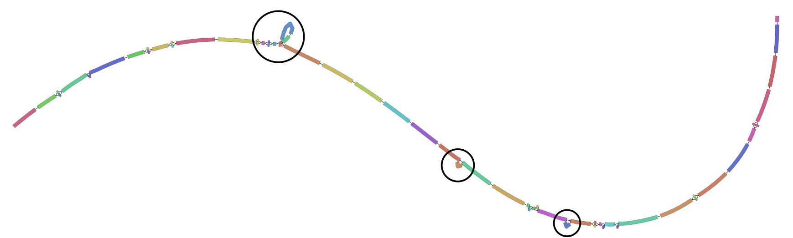
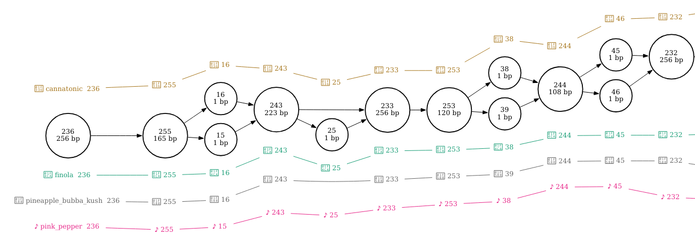
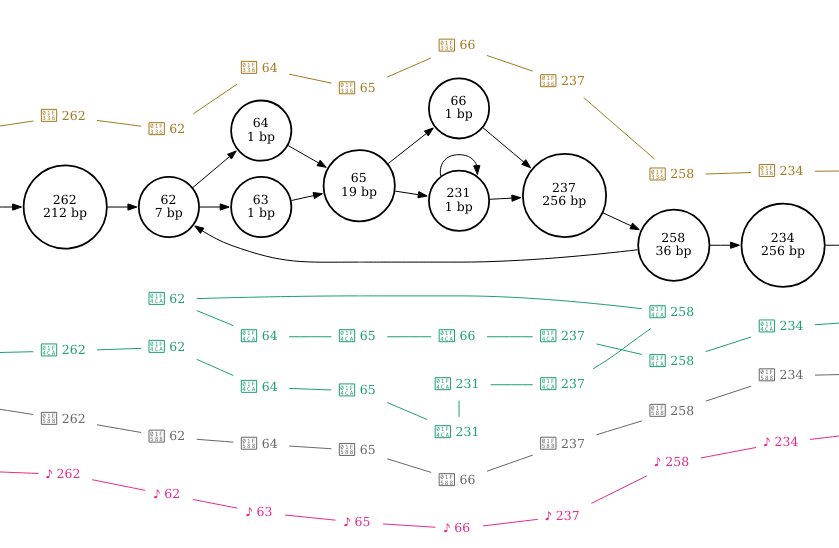
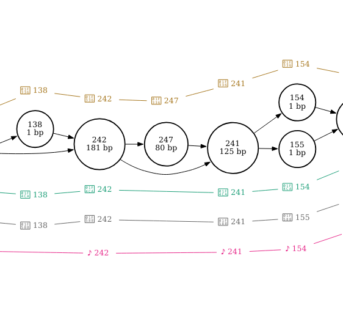
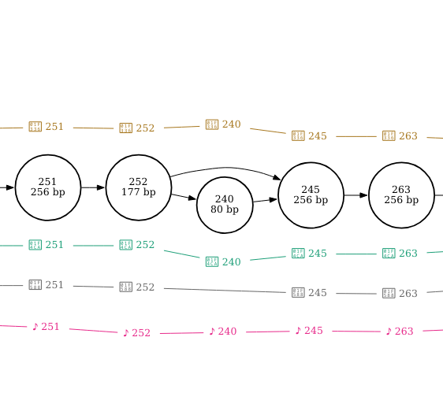
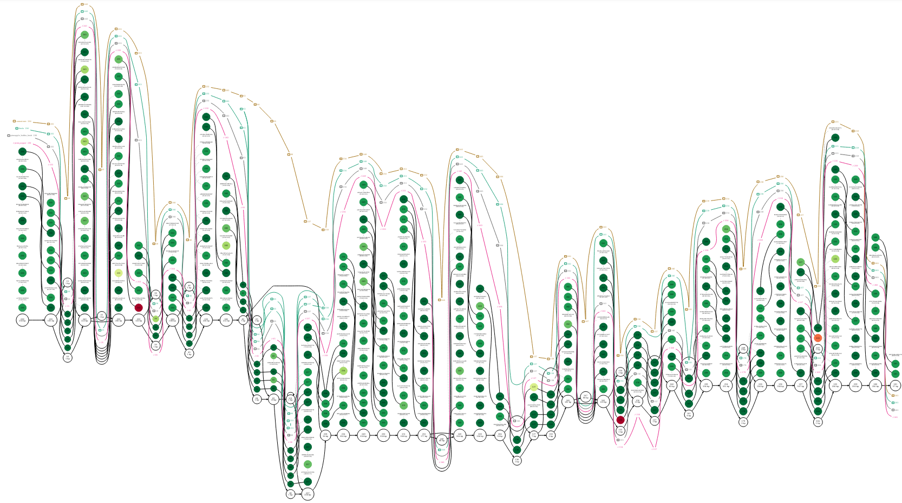

# Code/explanation for Part5 of Prac 1

The provided `cannabis.fasta` file contains 4 sequences all taken from the same region of the cannabis genome.

```
>pink_pepper
>finola
>pineapple_bubba_kush
>cannatonic
```

Build a genome graph from a multiple sequence alignment of these four sequences, index the graph, and then visualise the graph.

```
# Construct a genome graph using the multiple sequence alignment method
# The --base option sets pink_pepper as the "reference" sequence.
# Setting pink_pepper as the reference will not change the actual sequence content of the graph but it will change the way your graph looks a little bit and in our case, it helps with interpretation

vg msga -f cannabis.fasta -t 2 -k 16 --base pink_pepper | vg mod -U 10 - | vg mod -c -X 256 - > cannabis.vg

# index it (required for vg viz as well as the upcoming mapping step)
vg index -x cannabis.xg cannabis.vg
vg index -g cannabis.gcsa -k 16 cannabis.vg

# Visualise it all the ways
vg view -dpS cannabis.vg | dot -Tpdf -o cannabis.pdf

vg view cannabis.vg > cannabis.gfa
Bandage image cannabis.gfa cannabis_bandage.png

vg viz -x cannabis.xg -o cannabis.svg

```


**NOTE:** Sometimes it's hard to see your bandage plot because the nodes are too skinny and the graph is too long.
You can make the nodes wider using the `--nodewidth` parameter.
It takes values between 0.5 and 1000 and the default is 5.

For more ways to modify the way your bandage plot looks, run `Bandage image --helpall`.



I've circled three locations on the plot that show our three structural variants and you'll notice that they're all just alternative paths along the graph that look like loops.
We can't tell from the bandage plot what is going on in each sample or what paths each sample takes.
It gives us some idea about the amount of variation contained within the graph.
For example, if this part of the cannabis genome was highly variable we'd see a very messy graph.

Now, let's look at the graphviz `dot` format plot.

We can see each of our four sequences represented as a different coloured path along the graph.
If we look carefully at the graph, we can see that each of the the sequences finola, pineapple bubba kush, and cannatonic have one structural variant (usually defined as a variant > 50bp in length) when compared with the pink pepper reference.




I've zoomed in on the regions that correspond with the three structural variants in the figures below.

By setting pink pepper as the reference sequence, it is much easier to see that this section of sequence is duplicated in finola and is located between nodes 62 and 258.
It looks as though the duplicated sequence is approximately 320 bp in length if you add up the length of these nodes (inclusive).



The insertion is found at node 247 in cannatonic and is 80bp in length.



The deletion is found at node 240 in pineapple bubba kush and is also 80 bp in length.



If this took you a long time, don't worry. In the next practical we will learn how to call variants programmatically.
Being able to visually explore variants in a graph like we just did can be used to tease apart complex regions and better understand their structure and the relationships between haplotypes but it doesn't tend to be used on a large scale.

Next, let's align reads to our graph and visualise our alignments with `dot`.

```
vg map --fastq mystery.fq -x cannabis.xg -g cannabis.gcsa > mystery.gam
vg view -dpS cannabis.vg -A mystery.gam | dot -Tpdf -o alignments.pdf
```



If we go to the locations of the structural variants, we can see which structural variant they support.
We will start with the deletion and insertion because the long length of the duplication compared with the short length of the reads means that it will be difficult, if not impossible to interpret (if we had long reads this would be much easier).


At node 247, cannatonic was found to have an 80bp insertion.
Do your reads align to node 247? Mine don't so I don't think these reads are from this sample.

Looking at the location of the deletion at node 240, we again don't have any reads aligning. However, because this is a deletion in the pineapple bubba kush sequence, we wouldn't expect reads to align to node 240 if these reads were from this sample.
Therefore, our reads are probably from the pineapple bubba kush sample.

We could try to confirm this by looking for any other locations where the pineapple bubba kush path differs from the other three paths and seeing whether our reads are aligning to the same path.

For example, node 25 is a 1 bp deletion that is only found in pineapple bubba kush and none of the reads spanning this deletion have node 25 in their path.

If you found this confusing or it took you a long time, don't worry. In the next practical we will learn how to call variants programmatically.                                                             Being able to visually explore variants and read alignments in a graph like we just did can be used to tease apart complex regions of a pangenome and better understand their structure and the relationships between haplotypes but it doesn't tend to be used on a large scale.
In fact, one of the main uses for visualisation is for debugging graph construction and read alignment algorithms.

These are not the only ways to explore these read alignments.
You could also add read alignments to the graph as paths with `vg augment` and/or subset the graph with `vg find` to zoom in on a small part of the graph.
You could try `vg viz` to look at these augmented paths or use graphviz `dot` with the same or  different parameters.

The code below augments the graph with read alignments as paths and visualises in case you're interested in trying.

```
# first add the alignments to the graph as paths.
vg augment --label-paths cannabis.vg mystery.gam > augmented.vg

# visualise with dot without subsetting the graph
vg view -dSp augmented.vg | dot -Tpdf -o augmented_dot.pdf

# visualise with subsetting requires an xg index
vg index -x augmented.xg augmented.vg

# Lets zoom in on the duplication (node 65 in the augmented_dot.pdf)
vg find -n 65 -x augmented.xg -c 10 | vg view -dpS - | dot -Tpdf -o duplication.pdf
```

