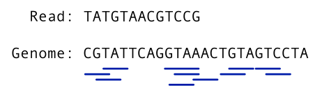

## Graph Genomes Practical: Part 2

## Chelsea Matthews - modified from Yassine Souilmi

### Learning Outcomes

1. See how alignment parameters (in this case minimum read length match) can alter alignment rates.

2. See how read alignment rates to a linear reference compare with alignment rates to a graph incorporating variants found within that population.

3. Have a basic understanding of genotyping.

## Introduction

One of the main goals for graph pan-genomes is to be able to use them as an alternative to a linear reference genome.
In order to do this, we need to be able to align reads to them.
We saw how this was done with a set of three reads in the first part of the practical.
Today, we'll be aligning reads to a much larger graph and comparing the read alignment rate of these reads with the read alignment rate of the same reads to a linear reference genome.⋅
This will hopefully show how read alignment rates are improved by aligning to a graph with some natural variation from the population built in.
This improvement is due to the way that different paths through the graph represent different possible genomic sequences and so a graph is more likely to contain a genomic sequence that is more similar to the newly sequenced sample than a linear reference genome.⋅


### Getting (re)started

Let's load the tools we'll need today. 

```
source activate bioinf
```

The tools we'll need today include:

```
vg
bcftools
jq -h
dot --help
```

You're already familiar with `vg` and `dot` from the first practical. 
You may have used `bcftools` before but if not, it's a tool that is designed for use in variant calling pipelines.
It allows us to manipulate VCF (variant call format) files which is what we'll use it for today. 
And finally, `jq`.
This is a tool for processing and filtering JSON files.
We will be using it, as well as a few other commands, to summarise read alignment rates against different graphs.

We'll create a new directory for todays prac so we don't get too confused by all the files. 

Copy all of the files from `data/graph_genomes/prac2/` into a new directory for todays practical.
`cd` into that directory.

```
cd ~
mkdir -p GraphGenomes/prac2/{yeti,cannabis,1000genomes}
cp /shared/data/Graph_Genomes/prac2/{z.*,README.md} ~/GraphGenomes/prac2/1000genomes/.
cp /shared/data/Graph_Genomes/prac2/{yeti*,nylamo*} ~/GraphGenomes/prac2/yeti/.
cp /shared/data/Graph_Genomes/prac1/cannabis.fasta ~/GraphGenomes/prac2/cannabis/.
cd ~/GraphGenomes/prac2
```

You should get the following by running `tree` from the `GraphGenomes/prac2` diretory. 

```
.
├── 1000genomes
│   ├── README.md
│   ├── z.fa
│   ├── z.fa.fai
│   ├── z.vcf.gz
│   └── z.vcf.gz.tbi
├── cannabis
│   └── cannabis.fasta
└── yeti
    ├── nylamo.fq
    ├── yeti.fa
    └── yeti.vcf
```

### Part 1: Genotyping and Variant Discovery - Yeti dataset

Let's explore how we can use read alignment against a graph to genotype a newly sequenced sample.

Genotyping is where we identify the specific genomic makeup of a sample.
In this case, we will use a graph constructed from known variants found within a particualr population and we will identify which of these variants a newly sequenced sample has. 
This process is used for a range of applications. 
For example, genetic screening. 
If we know of the specific variants that cause certain diseases, we can use genotyping to determine whether a person/organism will have those diseases or not.

You have been provided with a yeti reference sequence `yeti.fa` and a vcf - `yeti.vcf`.
The vcf contains variants called from a number of different types of yeti's and so should hopefully represent a good range of the natural genomic variation within the yeti population. 
There are also reads in a file called `nylamo.fq`.
Nylamo is the yeti sample that we will be genotyping. 

First, we build a variant graph from the reference genome and the vcf. 
Note that unlike in prac 1, we must include the `-a` option in our `vg construct` call. 

```
cd ~/GraphGenomes/prac2/yeti
vg construct -r yeti.fa -v yeti.vcf -a > yeti.vg
```

- Can you tell what the `-a` option does?

Index this graph as below and then have a quick look at it.
Again note that the xg indexing command is slightly different.  

```
vg index -x yeti.xg -L yeti.vg
vg index -g yeti.gcsa -k 16 yeti.vg

vg view -dpn yeti.vg | dot -Tpdf -o img_yeti_dot.pdf
vg view yeti.vg > yeti.gfa
Bandage image yeti.gfa img_yeti_bandage.png
```

Align the reads in `nylamo.fq` to the graph and then filter these alignments to remove secondary alignments and ambiguous read mappings. 

```
vg map --fastq nylamo.fq -x yeti.xg -g yeti.gcsa > nylamo.gam
vg filter nylamo.gam -r 0.90 -fu -m 1 -q 15 -D 999 -x yeti.xg > nylamo_filtered.gam
```

- What parameters are we using to filter our reads?

Now, we will now use `vg pack` to determine read support for the graph.

```
vg pack -x yeti.xg -g nylamo_filtered.gam -o nylamo.pack
```

And finally, we will genotype the sample. 

```
vg call yeti.xg -k nylamo.pack -v yeti.vcf > nylamo_genotype.vcf
```

Open the output file so that you can have a look at it.

The genotype of the sample is found at the start of the final column.
For example, 0/0 means that the sample was homozygous for the reference allele.
1/1 indicates that the sample is homozygous for the alternative allele.
1/0 means that the sample was heterozygous with one copy of the reference allele and one copy of the alternate allele.

#### Questions:

- Which variants are present in the nylamo sample? Which variants are not?
- Can you find the quality scores and read depth for each variant call?

## Part2: Infer variants from an MSA graph - Cannabis dataset

In the last practical we constructed a graph using the multiple sequence alignment technique for 4 different cannabis sequences from the same region of the genome and looked at the differences in their structure using visualisation techniques. 
We will now use this same graph but will call variants from the graph programmatically. 

Let's build the graph again. 

Move into the `cannabis` directory, construct the graph, and index it (we only need the xg index).  

```
cd ~/GraphGenomes/prac2/cannabis
vg msga -f cannabis.fasta -t 2 -k 16 --base pink_pepper | vg mod -U 10 - | vg mod -c -X 256 - > cannabis.vg
vg index -x cannabis.xg cannabis.vg
```

Now use `vg deconstruct` to generate a VCF using the pink_pepper sequence as the reference. 
Notice how `deconstruct` is the opposite to `construct`?      
We use the `vg construct` command to build a graph with a reference and a set of variants, and we use the `vg deconstruct` command to extract variants from a graph.

```
vg deconstruct cannabis.xg -e -p "pink_pepper" > variants.vcf
```

Let's have a look at the resulting file. 

```
less variants.vcf
```

Unfortunately the vcf's produced by vg don't give us the type of variant or its length but I think we can work it out. 

- What are the positions of the three structural variants we looked for last time (duplication, insertion, and deletion)?

This method is obviously much easier than manually looking through a graph to work out how each sample varies from the reference and can be used at much larger scales than we have just seen. 

## Part 3: Investigating factors impacting read alignment to graphs

Let's move on to the 1000 Genomes data. 

```
cd ~/GraphGenomes/prac2/1000genomes
```

The z files contain 1Mbp of 1000 Genomes data for chr20:1000000-2000000.
The reference sequence is contained in `z.fa`, and the variation is contained in `z.vcf.gz`.

## Background and Setup

The goal of this section is for you to investigate how read alignment rates change with one of two conditions but before you split off to investigate on your own, we will go through the setup and the questions. 


As in the first practical, we will build two graphs - one with just the reference sequence and one with variation obtained from the 1000 Genomes project. 
- Build a reference-only graph named `ref.vg`
- Build the same graph but with variation included named `z.vg`

```
vg construct -r z.fa -m 32 > ref.vg
vg construct -r z.fa -v z.vcf.gz -m 32 > z.vg
```

You might be tempted to visualize these graphs (and of course you are welcome to try), but they are sufficiently big already that your machine might run out of memory and crash.

Now index your graphs. 

In a nutshell, mapping reads to a graph is done in two stages: first, seed hits are identified and then a sequence-to-graph alignment is performed for each individual read.
Seed finding hence allows vg to spot candidate regions in the graph to which a given read can map potentially map to.

```
vg index -x z.xg z.vg
vg index -g z.gcsa z.vg
vg index -x ref.xg ref.vg
vg index -g ref.gcsa ref.vg

```

We will now simulate some reads from our graph.
The `-a` parameter tells vg to output the read as well as information describing exactly where that read came from in the graph and hence, exactly where it should align to the graph when we map our reads. 
Keep in mind that this information is only relevant if we are mapping reads back to the exact same graph they were generated from. 
This information will be needed if you choose _Option 1_ but _Option 2_ also requires simulated reads and this format is fine so we can make them together. 

```
vg sim -x z.xg -l 100 -n 1000 -e 0.01 -i 0.005 -a > z.sim
```

- What do these reads actually represent?

Now let's map these reads to our graph and find out how the alignment went. 
Map using the command below and then take a look at the `aln_sum.json`
The -j parameter outputs a JSON file describing how each read mapped to the graph and how this compares with its true location.

```
vg map -x z.xg -g z.gcsa -G z.sim --compare -j | head -n 1 
```

The above command should have printed a chunk of text to your terminal that describes how just one of your reads aligned to the graph.  

- Can you understand it?

As you can see, there's way too much information for us to go through manually.

We can process ths information with `jq`, `awk`, and `sed` to get a summary of alignment correctness.
We can use this to quickly check if our alignment process is doing what we expect on the variation graph we're working on.
For instance, we might have set alignment parameters that cause problems for our alignment which we could observe using the `--compare` feature of the mapper.

Let's summarise the alignment correctness for the mapping we just did but keep in mind that your results will be slightly different from mine because we all have a slightly different set of reads and also, the alignments may come out in a different order over multiple runs. 

```
vg map -x z.xg -g z.gcsa -G z.sim --compare -j | jq .correct | sed s/null/0/ | awk '{i+=$1; n+=1} END {print i/n}'
```

#### Questions:

- What is the `jq .correct` part doing? 
- What is the `sed` part doing?
- What is the `awk` part doing? 
- How well were our reads aligned? Why isn't this number 1? 
- What might we put instead of `jq .correct` to get some idea of how well our reads aligned to a graph they didn't come from?

The goal of this final section is for you to investigate one (or both) of the following questions on your own or in a group using the method above to summarise read alignment correctness or read identity if you're choose option 2. 

**Option 1:**

- How does the minimum Maximal Exact Match (MEM) length impact read alignment rates and accuracy?

**Option 2:**

- How do read alignment rates and accuracy compare when using a linear reference, a graph containing only common variants, and a graph containing all variants for that population?

### Option 1 Instructions 

The `-k` parameter used when mapping reads to a graph is described as "minimum MEM length" in the documentation. 
MEM stands for "Maximal Exact Match".
MEM's are exact matches between two sequences that cannot be extended either way without introducing even one mismatch. 
They are used in read alignment as "seeds", possible locations that the read could align. 

The figure below shows all of the Maximal Exact Matches between a read and a genome for a value of k=3, meaning that the length of matching sequences found in both the read and the genome will be 3 or more.
Therefore, all k-mers of 3 or more basepairs common to both the read and the reference are underlined. 
These matches are used as starting points, or "seeds", for read alignment. 



You can vary this parameter within the mapping command by changing the question mark below to your k-value of choice. 

```
vg map -k ? -x z.xg -g z.gcsa -G z.sim --compare -j | jq .correct | sed s/null/0/ | awk '{i+=$1; n+=1} END {print i/n}'
``` 

#### Questions:

- Does read alignment correctness get better or worse as k increases? 
- For what (approximate) range of k values does read alignment correctness remain the same? Can you explain why?
- If our reads had a higher error rate, would this range of k values change? How? 
- Would it be sensible to choose a very small value of k (eg `-k 5`) as a default value? Why or why not?

### Option 2 Instructions

You are investigating how read alignment rates change with the amount of variation within a graph. 

We have already built a graph with no variation - `ref.vg`, and a graph with all of the variants identified in the 1000 genomes project for this section of the genome - `z.vg`
You will now build a graph containing only variants found within at least 20% of the population and compare read alignment rates between the three graphs. 

You can make a VCF with a minimum allele fequency with the command below noting that AF stands for allele frequency:

```
bcftools filter -i 'AF > 0.2' z.vcf.gz > af20.vcf
```

Next, build a new graph using the reference and this filtered VCF. 

```
vg construct -r z.fa -v af20.vcf -m 32 > af20.vg
vg index -x af20.xg af20.vg
vg index -g af20.gcsa af20.vg
```

You should now have three graphs:

`ref.vg` - just the reference sequence, no variation

`20af.vg` - graph containing common alleles only

`z.vg` - graph containing all alleles identified in the 1000 genomes project for this section of the genome 

Now, align your simulated reads to all three graphs one at a time and compare mapping identity rates.
We don't have a "truth set" for the alignment of these reads to either the ref.vg or filtered.vg graphs because they didn't originage from either of these graphs.
Therefore, when we filter using `jq`, we will use `.identity` instead of `.correct`. 

For example, the command to align to `z.vg` and summarise read mapping identity would be:

```
vg map -x z.xg -g z.gcsa -G z.sim --compare -j | jq .identity | sed s/null/0/ | awk '{i+=$1; n+=1} END {print i/n}'
```

Feel free to build another graph with a different allele frequency cutoff to explore further.

#### Questions:

- What was the read alignment identity for each of your graphs?
- Take a look at the file sizes for each of your .vg graphs and their .gcsa index. How do these files scale with the amount of variation within the graph?
- Given that the .gcsa index is a k-mer index that is used for read alignment, how might the addition of a single variant to the graph alter the number of k-mers in the graph? It might help to draw a picture.

