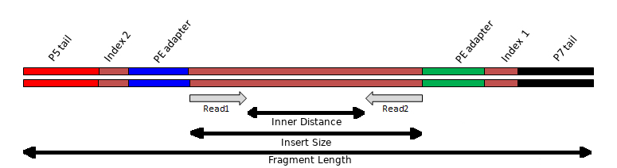

# Read Quality Control Practical

{:.no_toc}

* TOC
{:toc}

As with last week's practicals, you will be using RStudio to interact with your VM.

See [last week's practical](../Bash_Practicals/1_IntroBash.md#rstudio) to remind yourself how to connect to your VM.

# Setup for today

## Working Directory

First we will set up a directory for today's practical.
In general it is very worthwhile to keep all your project-specific code and data organised into a consistent location and structure.
This are not essential, but is very useful and is in general good practice.
If you don't follow this step, you will be making your life immeasurably harder for the duration of this practical.

To make and enter the directory that you will be working in, run the following commands in the terminal pane.

```bash
mkdir --parents ~/Project_1/data
cp ~/data/ReadQC/ERR1949188_?.fastq.gz ~/Project_1/data/
cd ~/Project_1/
```

### Questions

{:.no_toc}

* *What did the command line argument `--parents` do?*
* *What was the effect of using `?` in the filename during the `cp` command?*

You will now find yourself in this directory you have created.
If you look at the bottom right pane of your RStudio session you will see `Project_1` appeared when you executed `mkdir ~/Project_1`.
If you need to, you can navigate through the directories and select files with the file navigation pane just as you would with a normal file browser.

Making, and working within, this directory will help you keep everything organised so you can find your work later.
Managing your data and code intelligently is a considerable challenge in bioinformatics.

## Software Environment

For the practicals, we have used an anaconda (`conda`) software environment to provide access to some software.

For today's practical, you need to activate the `base` conda environment:

```bash
a1234567@ip-10-255-0-115:/shared/a1234567$ source activate bioinf
```

This will activate the three software tools (`fastqc`, `trimmomatic` and `fastp`) that you will need for this practical.

When you do this, your prompt will change and you will see something like this:

```bash
(base) a1234567@ip-10-255-0-115:/shared/a1234567$
```

the `(base)` prefix lets you know you are in the `base` conda environment, with access to the packages installed for that environment. Don't worry if this seems confusing, just be aware that if we instruct you to use `conda` packages in future practicals that you must use `source activate bioinf` to be able to access those applications/programs.

# Read Quality Control

## Initial Goals

The basic aims of this session are:

1. Gain familiarity with high throughput sequencing data files (FASTQ reads)
2. Learn how to assess the quality of the FASTQ reads
3. Learn how to perform adapter and quality trimming

---

## High Throughput Sequencing Data

Before we can begin to analyse any data, it is helpful to understand how it was generated.
While there are numerous platforms for generation of HTS data, today we will look at the Illumina Sequencing by Synthesis method, which is one of the most common methods in use today.
It is worth looking at the following 5-minute video from Illumina:

[](https://youtu.be/fCd6B5HRaZ8)

Illumina have released [multiple sequencing machines](https://sapac.illumina.com/systems/sequencing-platforms.html), with different capabilities, throughputs and applications.

## 3' Quality Drop-Off

During the bridge-amplification stage, millions of clusters are created on the flowcell.
Each cluster comprises of 1,000-2,000 identical copies of the same template.
During the process of sequencing, the polymerases attached each of the thousands of copies in a cluster "advance" one base at a time.
At the start (5' end) all the polymerases are in perfect sync; generating a bright, clean, consistant light signal for detecting which base was incorporated.
However, as time progresses, some polymerases fall behind while some race infront.
The polymerases gradually get further and further out of phase with each other.
This leads to dimmer and less clear signals for detection, and thus lower quality base-calls.

The phasing problem seen with Illumina sequencing has improved dramatically over the years, resulting in read lengths increasing from 35 bp to 250 bp.

## Sequencing Template Components

The above video picks up after the process of fragmentation, as most strategies require fragments of a certain size range.
This step may vary depending on your experiment, but the important concept to note during sample preparation is that the DNA insert has multiple oligonucleotide sequences ligated to either end, which together constitute the "sequencing template".
These include 1) the sequencing adapters, 2) index(es) and 3) the flow-cell binding oligos:



### Insert

The Illumina library prep aims to fragment the DNA into pieces ~300-400 bp in length.
If the DNA is fragmented too much, the distribution of insert sizes will be much shorter.
Some inserts may be shorter than the read length being generated, causing "read-though" to the adapter at the 3' end of the read.

### Adapters

During the library prep, a "Y" shaped adapter is used.
This results in a different adapter sequence being present at opposite ends of the insert.
To more accurately detect and remove adapter sequences from reads, resulting from read-though, it is beneficial to know which adapter sequences were used during the construction of the library.
However, because there are a limited number of standard Illumina adapter sequences in use, tools can often determine this for you.

### Index(es)

The inclusion of index sequences within the template allow DNA from different samples to be multiplexed and sequenced together.
The index sequences can then be detected and used to demultiplex reads into different files, each file representing a different starting sample.

The use of indexes is important for sequencing smaller genomes, especially where higher throughput instruments are being used. They are also used extensively in RNA-seq where many samples and replicates are often sequenced as part of a large transcriptomics experiment.

## Single-end (SE) and Paired-end (PE)

Illumina sequencing provides the option of returning a single read from one end of the template (priming initiated from the P5 adapter).
This is called single-end (SE) sequencing and often expressed with the length of the read as "1 x 75 bp" for example.

It is also possible to generate a second read from the other end of the template (priming initiated from the P7 adapter).
This is called paired-end (PE) sequencing and is often expressed with the length of the read as "2 x 75 bp" for example.
The first read in a pair is often refered to as the "R1" while the second read in a pair is often refered to as the "R2".

Paired-end reads provide:

* More bases from the insert compared to a single-end read - up 2x as many!
* The expected distance between the reads of a pair provide additional constraints around where the read pair can/should align to a genome - the reads from a pair must align within ~300-400 bp of each other.
* The reads must align to the genome with the correct relative orientation. For paired-end reads this is often refered to as: forward-reverse (fr), innies or simply &#8594;&#8592;

## FASTQ Files

There doesn't yet exist a technology capable of "reading" an entire chromosome in 1 continuous piece with 100% accuracy.
Instead we have to make use of technologies capable of generating short (<300bp) but accurate (>99%) reads.

FASTQ files are plain-text, although they are usually compressed using `gzip` and have the file extension `.gz`.
Lets take a look:(note that we use `\` to make this more readable. `\` allows us to use multiple lines without an actual end of line character, therefore the three lines below are read as one line)

```bash
gunzip \
  < data/ERR1949188_1.fastq.gz \
  | head --lines 8
```

### Question

{:.no_toc}

* *What do you think `gunzip` is doing here?*

You should see something like the following.
Here we have 2 reads in FASTQ format, each occupying 4 lines, where the lines represent:

 1. Read identifier. This line starts with the `@` symbol - although you shouldn't rely on an `@` symbol at the start of a line to signify the start of a read.
 2. Sequence string
 3. A `+` symbol. The read identifier may also immediately follow but this is now rare as it significantly adds to the total file size.
 4. Quality string

```
@HWI-ST999:249:C7M33ACXX:5:1101:3013:2151 1:N:0:TGACCACACTGT
CGCGATAATAATACGCACCGATGACTGGGTGAGAATATTACTTAAGTTCAACAGACTTAAAAATGTTGGGTCCTGGAAAATAATAATCGCCAGC
+
FHHHHHIIJIIJJJJJJJJJJJJJJJJJG@@GIIIGIIJJJJGJJIFH;>EEEDFFFFEEDDD;@@A;;??CDDDDD:>CDDDEECD@BDDB9@
@HWI-ST999:249:C7M33ACXX:5:1101:4346:2125 1:N:0:TGACCACACTGT
GGCACTATCACCGGCGTCTCACGCTTTATGCGCGAACAATCCAAACCGGTGACCATTGTCGGCCTGCAACCGGAAGAGGGCAGCAGCATTCCCG
+
FHHHHHJJJJJJJIJJJJIJJJJIJIIIJIJIJJJGHFDEFEEDEDDDDDDDCDDDDDEEB;BDDDDCDDDDBBBDABBDDBDDDDDBDCDEC<
```

The quality string has a character for each base in the sequence string.
Therefore, the length of the sequence string and the quality string should match.
Quality values are numbers from `0` to `93` and are often referred to as "Phred" quality scores.
To encode the quality scores as a single character, the scores are mapped to the ASCII table:


<https://www.commfront.com/pages/ascii-chart>

You will see that the first 33 characters (decimal values of 0-32) are all non-printable or white-space (think space, tab, backspace, bell etc).
The first printable character is `!` and this has the decimal value of `33`.
This character is used to represent a quality value of `0` while `"` has a decimal value of `34` and represents a quality value of `1` (`34-33`).
As such these quality scores are said to be Phred+33 encoded and the quality score is simply obtained by substracting 33 from the decimal value of the character in the quality string.

If you go digging into old Illumina files, you may find quality values which are Phred+64.
That is, a quality value of `0` is represented by `@` which has a decimal value of `64`.

FASTQ files can be easily compressed to ~20% of their uncompressed size.
Since most modern bioinformatics tools are capable of reading `gzip` compressed files, there should be very few reasons to store the uncompressed FASTQ files on disk!
Using compressed files saves a HUGE amount of disk space and also makes it faster to read the smaller amount of data off the disk!
If you find yourself uncompressing FASTQ files, you are likely doing something wrong; or you found one of the few tools that requires them to be uncompressed.

### Phred Score Interpretation

Phred quality scores give a measure of the confidence the caller has that the sequence base is correct.
To do this, the quality scores are related to the probability of calling an incorrect base through the formula

*Q =* −10log₁₀*P*

where *P* is the probability of calling the incorrect base.
This is more easily seen in the following table:

| Phred Score | Phred+33 Encoded Character | Probability of Incorrect Base Call | Accuracy of Base Call |
|:----------- |:---------------------------|:---------------------------------- |:----------------------|
| 0           | `!`                        | 1                                  | 0%                    |
| 10          | `+`                        | 10<sup>-1</sup>                    | 90%                   |
| 20          | `5`                        | 10<sup>-2</sup>                    | 99%                   |
| 30          | `?`                        | 10<sup>-3</sup>                    | 99.9%                 |
| 40          | `I`                        | 10<sup>-4</sup>                    | 99.99%                |

## Running FastQC

Run FastQC across the two files, timing how long it takes to complete:

```bash
cd ~/Project_1/
time fastqc data/ERR1949188_?.fastq.gz
```

From the output displayed in the terminal, we can see that FastQC processes the files serially.
That is, it processes each file one after the other.

The VM's on which you are working have 2 CPUs/cores.
You could utilise both these cores to speed up the process of running FastQC.
Check the manual help page `fastqc --help` to determine how to use more cores/threads.
Don't forget to time your "experiments" by prefixing your command with `time`.

## Inspecting FastQC Results

As we work through the QC reports we will develop a series of criteria for cleaning up our files.
There is usually no perfect solution, we just have to make the best decisions we can based on the information we have.
Some sections will prove more informative than others, and some will only be helpful if we are drilling deeply into our data.
Firstly we’ll just look at a selection of the plots.

By default, FastQC outputs a `zip` file and an `html` file alongside each FASTQ file it processed.
In the "Files" pane, navigate to the `~/Project_1/data` directory and click each of the `html` filenames in turn, selecting "View in Web Browser" as you go.

### Questions

{:.no_toc}

Using the FastQC Reports answer the following questions:

* *How many reads are in each of the two FASTQ files?*
* *How many read pairs are there?*
* *How many reads in total across both files?*
* *How many Mbp of sequence information is there across both files?*
* *Coverage (x or fold) is a measure of how many times you would expect each base in the genome to be coverage by an aligned base after aligning all the reads. It is simply calculated as the total bases in your reads divided by the genome size. Given the genome of E. coli K-12 is ~4.6 Mbp in size, how many fold coverage do we have?*

### Per Base Sequence Quality

{:.no_toc}

Click on the `Per base sequence quality` hyper-link on the left of the page & you will see a boxplot of the QC score distributions for every position in the read.
These are the Phred scores we discussed earlier, and this plot is usually the first one that bioinformaticians will look at for making informed decisions about the overall quality of the data and settings for later stages of the analysis.

#### Questions

{:.no_toc}

* *What do you notice about the quality scores as you move from the 5' to the 3' end of the reads?*
* *Do you think we might need to trim reads with poor quality 3' ends?*

### Per Base Sequence Content

{:.no_toc}

During the preparation of the sequencing library, the genome is randomly fragmented.
As such we would expect to observe relatively flat horizontal lines across this plot.
Demonstrating that we have indeed sampled fragments at random across the genome.
Depending on the GC content of the species, we might see the A and T lines tracking together but separately from the G and C lines.
It is also relatively common to see a drift towards G towards the end of a read.
This is because most modern Illumina sequencing is performed on a "2-colour" system and G is the absence of both colours.

#### Questions

{:.no_toc}

* *What do you think the GC content of E. coli K-19 is?*

### Overrepresented Sequences

{:.no_toc}

Here we can see any sequence which are more abundant than would be expected.
Sometimes you will see sequences here that match the adapters used in the library prep.

### Adapter Content

{:.no_toc}

For whole genome shotgut sequencing library preps we expect to see little adapter content in the reads.
If there is a significant up-turn in adapter content towards the 3' end, this may indicate the genomic DNA was over-fragmented during libarary prep.
If this is significant enough, it is worth asking the sequencing service provider to redo the library prep and sequencing.

#### Questions

{:.no_toc}

* *Do you think it will be necessary to look for and remove adapter sequences from the reads?*

## Adapter and Quality Trimming Reads

If we do not trim adapters or low quality regions from reads we might not be able to align reads to a genome.
Adapter-containing reads will fail to align as the adapter does not match anything in the genome.
Low quality stretches of reads might contain too many sequencing errors and stop the read aligning to the correct location in the genome.

If we have a large volume of data, the fact that a small proportion of reads contain some adapter or have low quality regions doesn't have a significant effect when aligning reads to a genome.
Those reads will just not align, but we have plenty more where they came from!
If you find yourself performing excessive quality or adapter trimming, the data is probably poor and you should have it resequenced or you have insufficient coverage and are trying to scrape-the-barrel to save every last read.
However, if you are planning to perform de novo genome assembly from the reads, then it is important to remove such regions as they can dramatically increase computational requirements.

There are many tools for performing quality and adapter trimming.
We are going to investigate the use of 2 tools: trimmomatic and fastp.

### Trimmomatic

Below is a basic trimmomatic command for processing paired-end data.
Modify the command to:

* Use 1 core/thread to compare to the default, which will use all cores available (2).
* Increase the quality value threshold, at which 3' quality trimming is performed, to 20
* Include a minimum length filter of 75 bp (hint look for `MINLEN` in the [manual](http://www.usadellab.org/cms/uploads/supplementary/Trimmomatic/TrimmomaticManual_V0.32.pdf).

```bash
# Trimmomatic requires any output directories to exist before running
mkdir --parents qc_reads/trimmomatic

time trimmomatic PE \
  data/ERR1949188_1.fastq.gz data/ERR1949188_2.fastq.gz \
  qc_reads/trimmomatic/ERR1949188_1.fastq.gz qc_reads/trimmomatic/ERR1949188_1.orphans.fastq.gz \
  qc_reads/trimmomatic/ERR1949188_2.fastq.gz qc_reads/trimmomatic/ERR1949188_2.orphans.fastq.gz \
  ILLUMINACLIP:${CONDA_PREFIX}/share/trimmomatic/adapters/TruSeq3-PE.fa:2:30:10:3:true \
  SLIDINGWINDOW:4:10
```

A common confusion that novice bioinformaticians have is about how command line arguments are specified.
Are they specified using a single hyphen (e.g. `-t`), two hyphens (e.g. `--threads`), no hyphen (e.g. `threads`) or something else?
Are the values separated with a space (e.g. `-t 2`), and equal sign (e.g. `-t=2`), no space at all (e.g. `-t2`), a colon (e.g. `t:2`) or something else?

There are some general guidlines, but ultimately it is up to the developer of the tool as to how they design/write their software.
The best thing to do is to read the manual and the help page to understand how it wants these thing specified.
[http://www.usadellab.org/cms/?page=trimmomatic#](http://www.usadellab.org/cms/?page=trimmomatic#)

#### Questions

{:.no_toc}

* *By allowing trimmomatic to use it's default of all possible cores (2 CPUs/cores in our case), how much quicker does trimmomatic finish?*
* *Does it matter what order the trimming steps are specified? Try specifying `MINLEN` before `ILLUMINACLIP` and then at the end. What happened and why?*
* *How many read pairs survived all the trimming and length filters?*

### fastp

The below `fastp` command has been constructed with the same kinds of trimming parameters we asked you to run trimmomatic with above:

```bash
mkdir -p qc_reads/fastp

time fastp \
  --thread 2 \
  -i ./data/ERR1949188_1.fastq.gz -I data/ERR1949188_2.fastq.gz \
  -o ./qc_reads/fastp/ERR1949188_1.fastq.gz \
  -O ./qc_reads/fastp/ERR1949188_2.fastq.gz \
  --unpaired1 ./qc_reads/fastp/ERR1949188_1.orphans.fastq.gz \
  --unpaired2 ./qc_reads/fastp/ERR1949188_2.orphans.fastq.gz \
  --cut_right --cut_window_size 4 --cut_mean_quality 20 \
  --length_required 75
```

#### Questions

{:.no_toc}

* *How much faster is `fastp` than `trimmomatic`?*
* *Do they perform comparably as each other in terms of the numbers of sequences passing the trimming/filtering?*

## Post-Trimming FastQC

To assess how the trimming has performed, run FastQC across the paired reads output by trimmomatic and fastp.

```bash
fastqc --threads 2 \
  qc_reads/trimmomatic/ERR1949188_?.fastq.gz \
  qc_reads/fastp/ERR1949188_?.fastq.gz
```

Take a look at the various FastQC HTML report files and compare pre and post trimming plots for:

* Per base sequence quality
* Overrepresented sequences
* Adapter Content

Generally, `fastp` performs comparably to `trimmomatic` but is faster. Do you think `fastp` has performed better for this dataset than `trimmomatic`?
`fastp` is able to deal better with 2-colour Illumina data and the corresponding poly-G "issue" observed at the 3' end of reads.
