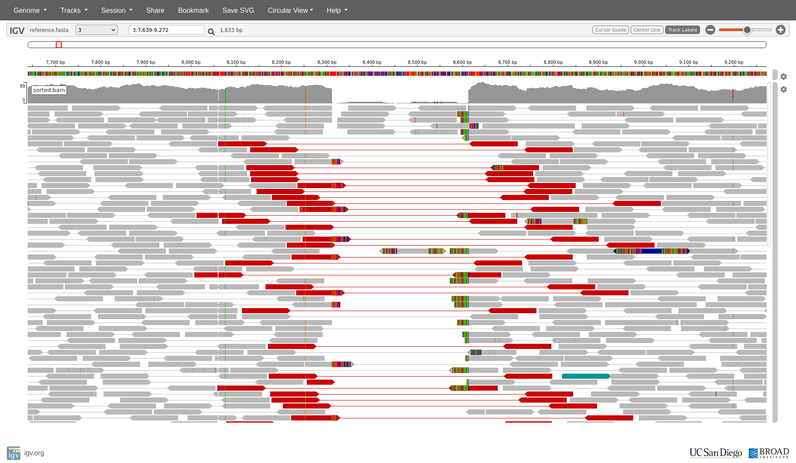
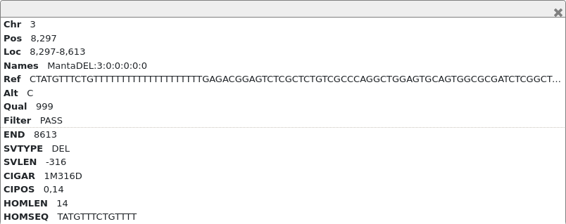
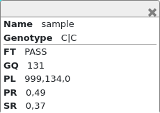

# Week 9 Practical Part 2: Structural variations - Paul Wang
{:.no_toc}

* TOC
{:toc}

## 1. Setting up data for this class

Create a working directory for this class and prepare the data

```bash
# create working directory
mkdir -p ~/wk9_sv
# enter the directory
cd ~/wk9_sv
# copy the data file from ~/data
cp ~/data/sv_data.tar.gz ./
# extract the archived data
tar -xvf sv_data.tar.gz

```

You should now see these files in your working directory:
```
.
├── manta-1.6.0.centos6_x86_64.tar.bz2
├── reference.fasta
├── reference.fasta.fai
├── sample.R1.fastq.gz
├── sample.R2.fastq.gz
├── sorted.bam
└── sorted.bam.bai

0 directories, 7 files

```

## 2. Preparing data for structural variation calling


The data we are looking at today is sequenced from a Coriell sample (NA12878), which is part of the Genome in a Bottle project, which provides well characterised samples that can be used for benchmarking tools. We are using a very small region of WGS data from this sample, just reads from a 200kb region on chr 3.

### 2a. Preprocessing the data (mapping and sorting reads)

This step is optional, but highly recommended that you go through them.
However, if it doesn't work,  you can simply use the pre-mapped and sorted data
(`sorted.bam`), and go straight to part b), **Visualising the data**.

First we need to prepare the reference for mapping.

```bash
bwa index reference.fasta
```

Then perform the alignment and read sorting:
```bash
bwa mem \
  -t 2 \
  -R '@RG\tID:1\tSM:sample' \
  reference.fasta \
  sample.R1.fastq.gz \
  sample.R2.fastq.gz \
  | samtools sort -@ 2 \
  --write-index \
  -o sorted.bam
```

Note that the `samtools sort` option `--write-index` creates a .csi index file,
rather than .bai. If you come across a program that does not support .csi and
requires .bai instead, you can generate .bai index by:

```
samtools index sorted.bam
```

### 2b. Visualising the data

Following the instructions for Week 3 Practical Part 1, visualise the mapped data by downloading the following files from the VM onto your workstation (via RStudio's file browser):

```
reference.fasta
reference.fasta.fai
sorted.bam
sorted.bam.csi # (or sorted.bam.bai if you have that instead)
```

Load `reference.fasta` and corresponding index file under **Genome**, and
load `sorted.bam` and index under **Tracks**.

1. Start from the 3' end, zoom in until you can start seeing aligned reads and coverage track.
2. To spot structural variations, it helps if you enable:
  * View as pairs
  * Color by: pair orientation & insert size (TLEN)
  * Show soft clips

You should be able to see the first SV at around 8,300-8,600bp.


* *What type of structural variation is this?*
* *Is it heterozygous or homozygous?*
* *Can you see the breakpoints? If so, use their co-ordinates and calculate the size of this SV.*

Now that you have some idea of what features to look for to spot an SV,
try to find the next one downstream. To make the search a bit faster,
zoom out so that the window view is ~25kb.

(*Hint: It's before 60kb*)

* *Answer the same questions as for the previous SV*
* *What are the features that you used to spot this SV?*
* *What makes it less easy to spot?*

## 3. Structural variation detection using manta

We are now going to use a SV caller to see if we can find any other SVs in this data.

Manta (https://github.com/Illumina/manta) detects structural variations in paired-end
sequencing data by looking for breakpoints (split-reads), improper read-pairs, or inserts of usual sizes.

Manta works best with WGS data. For example, had we used the WES data for this sample
instead, the previous two SVs likely will not have been detected,
since they were not near any known exons.

A pre-compiled version of manta is provided in the data. First you need to uncompress the file:

```bash
tar xvf manta-1.6.0.centos6_x86_64.tar.bz2
```

This should have extracted into a directory called `manta` with 4 sub-directories.

```
manta/
├── bin
│   ├── configManta.py
│   ├── configManta.py.ini
│   └── runMantaWorkflowDemo.py
├── lib
├── libexec
└── share
```

Manta execution is a 2-step process, first you need to run `configManta.py`, which setups the manta pipeline in a specified output directory, and then you can execute the script generated.

Execute `configManta.py` with no arguments to see how to use the command:

```
$ manta/bin/configManta.py

Usage: configManta.py [options]

Version: 1.6.0

This script configures the Manta SV analysis pipeline.
You must specify a BAM or CRAM file for at least one sample.

Configuration will produce a workflow run script which
can execute the workflow on a single node or through
sge and resume any interrupted execution.

Options:
  --version             show program's version number and exit
  -h, --help            show this help message and exit
  --config=FILE         provide a configuration file to override defaults in
                        global config file (/home/paul/Insync/gdrive/work_stuf
                        f/2022_UA_genomic_applications/final_dataset/class_set
                        /manta/bin/configManta.py.ini)
  --allHelp             show all extended/hidden options

(etc...)
```

*Feel free to figure out for yourself how to get it to run this sample!*

First step is to execute `configManta.py`, which will generate manta workflow scripts.

```bash

manta/bin/configManta.py \
  --bam sorted.bam \
  --referenceFasta reference.fasta \
  --runDir manta_output

```

This should then create a sub-directory, `manta_output`, with the structure:

```
manta_output/
├── results
│   ├── evidence
│   ├── stats
│   └── variants
├── runWorkflow.py
├── runWorkflow.py.config.pickle
└── workspace
```

Then execute the `runWorkflow.py` script within:

```
manta_output/runWorkflow.py
```

If everything goes well you should see something like this at the end of the standard output:
```
[2022-05-11T01:36:39.577201Z] [bioinf-3010-2022-5] [218022_1] [WorkflowRunner] Manta workflow successfully completed.
[2022-05-11T01:36:39.577201Z] [bioinf-3010-2022-5] [218022_1] [WorkflowRunner]
[2022-05-11T01:36:39.577201Z] [bioinf-3010-2022-5] [218022_1] [WorkflowRunner]  workflow version: 1.6.0
[2022-05-11T01:36:39.577770Z] [bioinf-3010-2022-5] [218022_1] [WorkflowRunner]
[2022-05-11T01:36:39.578122Z] [bioinf-3010-2022-5] [218022_1] [WorkflowRunner] Workflow successfully completed all tasks
[2022-05-11T01:36:39.578464Z] [bioinf-3010-2022-5] [218022_1] [WorkflowRunner] Elapsed time for full workflow: 2 sec
```

Now, if you examine the directory `manta_output/results` you should see something like:

```
manta_output/
├── results
│   ├── evidence
│   ├── stats
│   │   ├── alignmentStatsSummary.txt
│   │   ├── svCandidateGenerationStats.tsv
│   │   ├── svCandidateGenerationStats.xml
│   │   └── svLocusGraphStats.tsv
│   └── variants
│       ├── candidateSmallIndels.vcf.gz
│       ├── candidateSmallIndels.vcf.gz.tbi
│       ├── candidateSV.vcf.gz
│       ├── candidateSV.vcf.gz.tbi
│       ├── diploidSV.vcf.gz
│       └── diploidSV.vcf.gz.tbi

```

The most important file is the `diploidSV.vcf.gz` file, which contains the
SV calls made by the caller.

Download this file and its index (`diploidSV.vcf.gz.tbi`) and load them into IGV.

It may be easier for viewing if you drag this track to be on top of the aligned reads track.
You can do this by dragging the grey bar on the right side of the track.

* Zoom out to the full view. As this is an index VCF file, you should be able
to see all the variants present in the VCF file. How many SVs have been called?

* The first SV might be hidden or obscured by the track label. You can fix this
by changing the track name (click on the gear icon to the right, and select
  "Set track name") to "."

* Zoom in to the first SV in the VCF track.

  * *Is this the same SV that you identified visually previously?*
  * *You should see a red bar and a blue bar. Click on them and see the information that shows up.*

The red bar shows the information about the variant.




The blue bar shows the sample specific information about this variant.
Since we only have one sample in this VCF file, there is only one blue bar.


