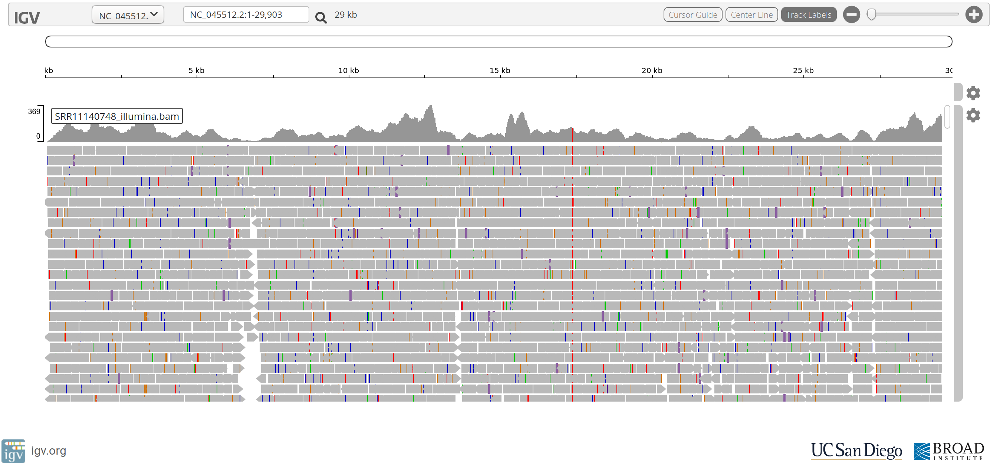
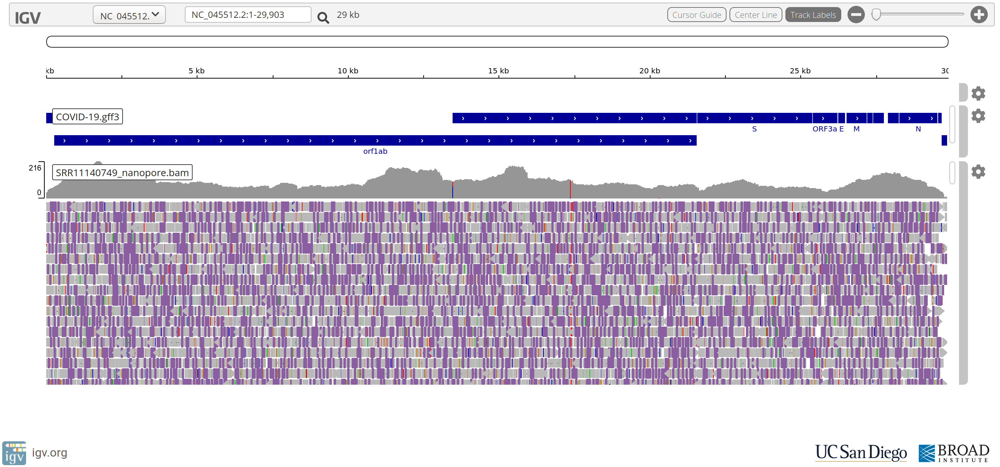

# Week 3 Practical Part 1: SARS-CoV-2 Resequencing
{:.no_toc}

* TOC
{:toc}

As with previous week's practicals, you will be using RStudio to interact with your VM.

See [week 1's practical](../Bash_Practicals/1_IntroBash.md#rstudio) to remind yourself how to connect to your VM.

# Setup for today

## Working Directory

First we will set up a directory for today's practical.
In general it is very worthwhile to keep all your project-specific code and data organised into a consistent location and structure.
This are not essential, but is very useful and is in general good practice.
If you don't follow this step, you will be making your life immeasurably harder for the duration of this practical.

To make and enter the directory that you will be working in, run the following commands in the terminal pane.

```bash
# Setup project working directory
mkdir --parents ~/Project_2/data/
cd ~/Project_2/

# load the required software environment
conda activate assembly
```

## Data

For the next couple of weeks we're going to be using some very topical data, SARS-CoV-2 data, the virus causing COVID-19.
We will be looking at this data in different ways, providing insights into how bioinformaticians analyses these types of data.

### RefSeq Genome Assembly

The most recent SARS-CoV-2 genome assembly is [NC_045512.2](https://www.ncbi.nlm.nih.gov/nuccore/NC_045512.2).

This assembly was generated from a sample collected in Dec 2019 and submitted to NCBI on 13th Jan 2020 as [NC_045512.1](https://www.ncbi.nlm.nih.gov/nuccore/NC_045512.1).
Subsequently, [NC_045512.1](https://www.ncbi.nlm.nih.gov/nuccore/NC_045512.1) was replaced by [NC_045512.2](https://www.ncbi.nlm.nih.gov/nuccore/NC_045512.2) on the 17th Jan 2020.

#### Question

 - *What is the size, in bp, of the SARS-CoV-2 genome?*

### Public Sequencing Data

Public sequence data is being released via NCBI's [SARS-CoV-2](https://www.ncbi.nlm.nih.gov/genbank/sars-cov-2-seqs/) page.

We will be looking at some data released on [21st Feb 2020](https://trace.ncbi.nlm.nih.gov/Traces/sra/?study=SRP250294) for a clinical swab obtained from a confirmed case in Madison, WI, USA.
For further information see: [https://openresearch.labkey.com/wiki/ZEST/Ncov/page.view?name=SARS-CoV-2%20Deep%20Sequencing](https://openresearch.labkey.com/wiki/ZEST/Ncov/page.view?name=SARS-CoV-2%20Deep%20Sequencing)

There is both Illumina and Oxford Nanopore data available for several samples.
We will be working with the `SRR11140748` sample but you are welcome to also look at any of the other 3 samples if you have time.
Here is a table of information linking to the orginal source of the data:

| Description  | Accession/URL                                                                                | Coverage |
|:-------------|:--------------------------------------------------------------------------------------------:|---------:|
| RefSeq       | [NC_045512.2](https://www.ncbi.nlm.nih.gov/nuccore/NC_045512.2?report=fasta)                 |          |
| **Illumina** |                                                                                              |          |
| veroSTAT-1KO | [SRR11140744](https://trace.ncbi.nlm.nih.gov/Traces/sra/?run=SRR11140744)                    |    7,586 |
| veroE6       | [SRR11140746](https://trace.ncbi.nlm.nih.gov/Traces/sra/?run=SRR11140746)                    |    5,328 |
| vero76       | [SRR11140748](https://trace.ncbi.nlm.nih.gov/Traces/sra/?run=SRR11140748)                    |    6,353 |
| swab         | [SRR11140750](https://trace.ncbi.nlm.nih.gov/Traces/sra/?run=SRR11140750)                    |      252 |
| **Nanopore** |                                                                                              |          |
| veroSTAT-1KO | [SRR11140745](https://sra-download.ncbi.nlm.nih.gov/traces/sra50/SRR/010879/SRR11140745)     |    8,727 |
| veroE6       | [SRR11140747](https://sra-download.ncbi.nlm.nih.gov/traces/sra50/SRR/010879/SRR11140747)     |   12,006 |
| vero76       | [SRR11140749](https://sra-download.ncbi.nlm.nih.gov/traces/sra53/SRR/010879/SRR11140749)     |   10,170 |
| swab         | [SRR11140751](https://sra-download.ncbi.nlm.nih.gov/traces/sra52/SRR/010879/SRR11140751)     |      792 |

We have also provided access to a subsample (~100x) of the above data sets to facilitate a more timely analysis and improve data visualisation responsiveness.

## Get the Data

```bash
# Make the directory for the Illumina PE reads
mkdir --parents ~/Project_2/data/illumina_pe/

# Get the Illumina data for the SRR11140748 sample
cp ~/data/genomics/SRR11140748_?_100x.fastq.gz ~/Project_2/data/illumina_pe/
```

# Genome Resequencing

Genome resequencing is performed when a good quality genome assembly already exists for a species.
We generate sequence data, most commonly Illumina reads, for one or more samples and align them to the reference genome.
We can then interrogate the read alignments and ask questions about how our sample differs from the reference genome and what the significance of those differences might be.

## Initial Goals

 1. Gain familiarity with aligning reads to a reference genome
 2. Gain familiarity with exploring read alignments using IGV, a genome browser
 3. Gain familiarity with Oxford Nanopore long read data

## FastQC

Using what you leared last week, run FastQC across the raw data for the `SRR11140748` sample and inspect the FastQC reports.

### Questions

 * What sort of quality based trimming is required?
 * Are any adapter sequences detected?
 * What are the read lengths?

## Quality and Adapter Trimming

Using what you learned last week and what you found in the FastQC reports generated above, processes the reads through `trimmomatic` or `fastp` if you deem it necessary.

Once you are happy the reads are of good quality, lets see how much data we have:

```bash
pigz --decompress --to-stdout --processes 2 \
  ~/Project_2/data/illumina_pe/SRR11140748_?_100x.fastq.gz \
| sed -n '2~4p' \
| awk 'BEGIN{OFS="\t"}{z+=length($0); y+=1}END{print z,y,z/y}'
```

### Questions

 - *What is the `pigz` command doing?*
 - *What do you think the `sed` command is doing? Hint: try replacing the `awk` command with a simple `less` command.*
 - *The `awk` command outputs a tab-delimited file consisting of 3 columns of numbers. What do the numbers represent?*
 - *Within the `awk` script are the variables `z` and `y`. These are not very descriptive of what values they actually hold. Rewrite the script, making these variable names more self-explainitory.*
 - *What is the mean length of the Illumina reads?*
 - *Given the size of the SARS-CoV-2 genome, what amount of coverage do we have for the `SRR11140748` sample?*

## Read Alignment

There are many tools for performing Illumina PE read alignment (aka mapping) against a genome.
Today we will use a tool called BWA.
Conceptually, a read aligner aims to find the most likely place in the genome from which the read was generated.
Think of this as looking up a persons name in a phonebook.

### Questions

Would it be easier to search for a name if:

 - *The names in the phonebook were sorted in alphabetical order or if they were in random order?*
 - *There was a tab index?*


### Indexing the Reference Genome

Having the information stored in a certain way and having an index makes looking up names in the phonebook much faster.
In the context of aligning reads to a reference genome, having an "index" of the reference genome speeds up the process of finiding and aligning reads to the genome.
The index of a genome is often tool-specific so we often need to create a different index for each tool we plan to use.

Like sorting and indexing a phonebook, this process is time consuming.
However, since it's only done once, and it provides significant speed-ups in read alignment, it is time well spent!

Index the reference genome:

```bash
# Make the directory for the reference genome
mkdir --parents ~/Project_2/data/reference/

# Get the SARS-CoV-2 reference genome
cp ~/data/genomics/COVID-19.fasta.gz ~/Project_2/data/reference/

# Index the reference genome for use with BWA
bwa index ~/Project_2/data/reference/COVID-19.fasta.gz
```

#### Questions

 - *What 5 files were created by the `bwa index` command? Hint: look at the contents of `~/Project_2/data/reference/`*
 - *What is the difference between the filenames of these 5 files?*

### Align the Illumina Reads

Align the Illumina PE reads to the reference genome:

```bash
# Create an output directory ahead of time
mkdir --parents ~/Project_2/resequencing/

# Align reads
time bwa mem \
  ~/Project_2/data/reference/COVID-19.fasta.gz \
  ~/Project_2/data/illumina_pe/SRR11140748_1_100x.fastq.gz \
  ~/Project_2/data/illumina_pe/SRR11140748_2_100x.fastq.gz \
> resequencing/SRR11140748_illumina.sam

# Coordinate sort SAM file, and output to BAM
time samtools sort \
  -o resequencing/SRR11140748_illumina.bam \
  resequencing/SRR11140748_illumina.sam
```

## Questions

 - *How big, in Megabytes, is the SAM file?*
 - *As a percentage of the SAM file size, what is the size of the BAM file?*
 - *Both the `bwa mem` and `samtools sort` commands have options for using multiple threads. Figure out what command line argument to use to change the number of threads to `2`.*
 - *Can you figure out how to do the `bwa mem` and `samtools sort` commands in a pipeline so as to avoid writing the large intermediary SAM file?*


### BAM File Visualisation

We are going to load the SARS-CoV-2 genome into a genome browser called IGV and then load the BAM file.
First, we need to create an index for the reference genome and an index file of the BAM file.
This ensures IGV can quickly load the reference sequence and corresponding read alignments for any coordinates we choose to navigate to.

```bash
# IGV-web requires an uncompressed reference sequence and corresponding index file
gunzip < ~/Project_2/data/reference/COVID-19.fasta.gz > ~/Project_2/data/reference/COVID-19.fasta

# Generate index of the FASTA-formatted genome file
samtools faidx ~/Project_2/data/reference/COVID-19.fasta

# Index the BAM file
samtools index resequencing/SRR11140748_illumina.bam
```

Download the following files to your local computer using RStudio's File browser.
Simply select 1 file at a time by checking the checkbox and click "More" >> "Export...".
Click the "Download" button and save it somewhere obvious.

 * `~/Project_2/data/reference/COVID-19.fasta`
 * `~/Project_2/data/reference/COVID-19.fasta.fai`
 * `~/Project_2/resequencing/SRR11140748_illumina.bam`
 * `~/Project_2/resequencing/SRR11140748_illumina.bam.bai`

Visit, [IGV-web](https://igv.org/app/) and load the genome from a `Local File ...` by selecting both the `COVID-19.fasta` and `COVID-19.fasta.fai` files.
Once the reference genome is loaded, load a "Track" from a `Local File ...` by selecting both the `SRR11140748_illumina.bam` and `SRR11140748_illumina.bam.bai` files.



#### Questions

 - *The stacked grey arrows represent the reads aligned to the SARS-CoV-2 reference genome. What do the coloured vertical bars within the reads indicate?*
 - *Do you see position in the genome where a coloured vertical bar seems to occur quite frequently?*
 - *Why does the read coverage drop towards zero at the ends of the reference genome?*

### Align the Oxford Nanopore Reads

Long reads have the potential for spanning "repeat" regions, untangling the mess that short reads make in these areas, provide evidence of structural variation etc.
Lets align the long reads to the reference genome.

```bash
# Index the reference genome for minimap2
minimap2 \
  -d ~/Project_2/data/reference/COVID-19.fasta.gz.mmi \
  ~/Project_2/data/reference/COVID-19.fasta.gz

# Get the Nanopore reads
mkdir -p ~/Project_2/data/nanopore/
cp ~/data/genomics/SRR11140749_1_100x.fastq.gz ~/Project_2/data/nanopore/

# Align the reads
time minimap2 \
  -ax map-ont \
  -t 2 \
  ~/Project_2/data/reference/COVID-19.fasta.gz.mmi \
  ~/Project_2/data/nanopore/SRR11140749_1_100x.fastq.gz \
| samtools sort --threads 2 -o resequencing/SRR11140749_nanopore.bam

# Index the BAM file
samtools index resequencing/SRR11140749_nanopore.bam
```

Load the nanopore read alignment file into your IGV-web.



#### Questions

 - *What do you make of the accuracy of the Nanopore reads compared to the Illumina reads?*
 - *Despite their poorer accuracy, do you still think Nanopore reads are useful?*
 - *What do you make of positions: `NC_045512.2:17373` and `NC_045512.2:20299`?*

# External Resources

 * [https://openresearch.labkey.com/wiki/ZEST/Ncov/page.view?name=SARS-CoV-2%20Deep%20Sequencing](https://openresearch.labkey.com/wiki/ZEST/Ncov/page.view?name=SARS-CoV-2%20Deep%20Sequencing)
 * [https://github.com/katarinabraun/SARS-CoV-2_sequencing](https://github.com/katarinabraun/SARS-CoV-2_sequencing)

