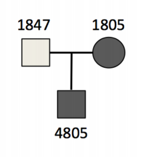

# Clinical Genomics & Pedigree Analysis

High-throughput sequencing is currently used ubiquitously in identifying the cause of a large range of genetic diseases.
While single gene and well-known Mendelian genetic disorders, such as sickle-cell anemia, Tay–Sachs disease and cystic fibrosis, can be identified with simple diagnostic techniques, whole genome (WGS) and exome (WES/WXS) sequencing can be used to identify and study a wide variety of inherited traits.
Cost used to be a barrier for using high-throughput sequencing approaches, but now it is possible to sequence a patient in [under 27 hours for less than ~US$1,000 per sample](https://genomemedicine.biomedcentral.com/articles/10.1186/s13073-015-0221-8). 

The resolution to which variants can be assessed with WGS means that it is also powerful approach to identify new genetic variants that cause disease.
Using WGS or WES on thousands of samples, we can now establish fine-grained association maps for more and more complex diseases that are likely to be caused by the action of hundreds of genes.

The current clinical workflow works a lot like this:


In Tuesday's tutorial, we discussed annotation of identified variants in three samples, and today we will be looking at family inheritance patterns.
As you may have noticed, the three samples sequenced in our data are related, and form a "trio" (mother-father-daughter). 
Trios and other members of an affected individual's family are often sequenced in clinical genetics, allowing clinicians to establish the inheritance pattern of the trait or identify new _de novo_ mutations that may have arisen independently of the parents.

## This week's tutorial

This week's tutorial is liberally taken from two tutorials written by Aaron Quinlan & his group at University of Utah.

- [Identifying dominant gene candidates with GEMINI](https://s3.amazonaws.com/gemini-tutorials/Gemini-Dominant-Tutorial.pdf)
- [Identifying recessive gene candidates with GEMINI](https://s3.amazonaws.com/gemini-tutorials/Gemini-Recessive-Tutorial.pdf)

Both of these tutorials do a really good job at introducing the program `gemini`, which is used quite a bit across clinical genetics studies.
[Gemini](https://gemini.readthedocs.io/en/latest/) is a database system that can read in VCF information and family/pedigree information, to enable database querying and clinical genetics analyses.
Information in gemini is stored in database system called SQL.
SQL (pronounced "ess-que-el") stands for Structured Query Language, and is a popular database system in many industries and enables the store of organised information that can be accessed by queries.
It comes in many flavours that you might have heard before, including `MySQL`, `SQLite` and `PostgreSQL`.

## Cohort databases

Lets make some databases!
Gemini can take the VCF file and sample information in the form of a ped file (short for pedigree).
The ped file is actually a standard metadata information file that was developed in the [genetics application `PLINK`](http://zzz.bwh.harvard.edu/plink/data.shtml#ped).
This program is used extensively for genome-wide association studies, and was developed in the era of genotyping arrays rather than WGS approaches. 

Unfortunately the database loading command also adds a lot of annotation information that requires >50GB of data to be used, so instead of running the loading commands below I will provide each database separately


```
# Loading VCF files require all the annotation databases
## Create the gemini db for dominant study
#gemini load --cores 4 -v trio.trim.vep.vcf.gz -t VEP \
#        --skip-gene-tables -p dominant.ped trio.trim.vep.dominant.db

# Copy the dominant gemini db to your working directory for todays prac
cp ~/data/genomics/trio.trim.vep.dominant.db .
```

We'll use this database for our querying and `autosomal_dominant` analysis.

## Querying a SQL database in Gemini

Firstly some quick points on SQL and examples on how to use SQL queries. 
The instructions for extracting data from the database file is relatively straight forward.
Information is stored in tables, much like a sheet within a Microsoft Excel Spreadsheet file.
You can ask the database to give you specific information and also put restrictions on the type of information thats needed (such as a conditional like "the sex of the person must be female").

Given that we are generally using the standard gemini tools to load and arrange data within the database, we will not be using a lot of the [standard SQL commands](https://www.codecademy.com/articles/sql-commands).
Really we only need to know how to query the database using the `SELECT` and `FROM` command.
We will also need some conditionals to  like `WHERE`, `IS`, `IS NOT` etc

In order to query we need to know what we have.

```
gemini db_info trio.trim.vep.dominant.db
```

As you can see, we have a number of tables.
Within those tables we have columns.
And the data within those columns has a specific data type.
All of these are available to be queried

Let's look at some examples by using the `gemini query` sub-command.

```
# Get everything from the samples table with a wildcard
gemini query -q "SELECT * FROM samples" trio.trim.vep.dominant.db

# Get the names of the individuals from the samples table
gemini query -q "SELECT name FROM samples" trio.trim.vep.dominant.db

# Get the names of the individuals from the samples table that are male
gemini query -q "SELECT name FROM samples WHERE sex IS 1" trio.trim.vep.dominant.db

# Get the names of the individuals from the samples table that are male
gemini query -q "SELECT name FROM samples WHERE sex == 1" trio.trim.vep.dominant.db

# Get the names of the individuals from the samples table that are male
gemini query -q "SELECT name FROM samples WHERE sex IS NOT 2" trio.trim.vep.dominant.db

# Get the names of the individuals from the samples table that are male
gemini query -q "SELECT name, sex FROM samples WHERE sex IS NOT 2" trio.trim.vep.dominant.db
```

Note: Depending on the data type, you may need to surround character info in ''. 


### TASKS: Build your query

Now that we known the query structure and tables that we have in our database, construct some more sophisticated queries.
1. Extract the chromosome and position of the variants in teh database that have a 1000 genome allele frequency in Europeans (aaf_1kg_eur) less than 0.5. How many are there?
2. Extract all the variants within the genes MAPK12 that have a variant quality > 200. How many are there? How many are also QUAL > 500?
3. How many variants that were marked as "PASS" quality were concordant 

## Autosomal Dominant disorder

Autosomal dominant disorders are genetic disorders that do not involve the sex chromosomes (those are referred to as "sex-linked") and are passed down through families in a vertical transmission pattern. 
Incomplete penetrance can occur within the family, meaning that disorder may skip a generation.
`Penetrance` here means "the extent to which a particular gene or set of genes is expressed in the phenotypes of individuals carrying it, measured by the proportion of carriers showing the characteristic phenotype."


Examples of these disorders include Huntington disease, neurofibromatosis, and polycystic kidney disease.

The trio that we will be looking at today is affected by a rare disorder called [_hypobetalipoproteinemia_](https://ghr.nlm.nih.gov/condition/familial-hypobetalipoproteinemia), a disorder that impairs the body's ability to absorb and transport fats.
It occurs in about in 1 in 1,000 to 3,000 individuals (1 in ~1,000 in Europeans).



Both the mother (`1805`) and the son (`4805`) are affected with the disorder, with normal plasma HDL, fat malabsorption and are in the bottom 5% for plasma cholesterol and triglycerides.
We want to be able to see these sort of relationships in the PED file so lets have a quick look at that

```
cat dominant.ped | column -t

#family_id  sample_id  paternal_id  maternal_id  sex  phenotype  ancestry
family1     1805       -9           -9           2    2          CEU
family1     1847       -9           -9           1    1          CEU
family1     4805       1847         1805         1    2          CEU
```

As you can see, all of the relationships between the individuals are recorded in the PED file, including the sex of the individuals and their prevalence of the phenotype.
You can imagine that when sampling larger families, or even populations, all of the unique inheritance patterns can be recorded here and used to inform the clinical model when it comes to identifying candidate genes or variants for the disorder.

## Sample genotype queries

Given that we will be comparing the pattern of inheritance of these variants, its easy to filter variants so that you pick up specific relationships between individuals.
For example, what if we wanted to identify variants where both 1805 and 4805 have a non-reference allele?
(After all, 1805 and 4805 are both affected)

```
# Show all info
gemini query -q "SELECT * from variants" \
            --gt-filter "(gt_types.1805 <> HOM_REF AND gt_types.4805 <> HOM_REF)" \
            --header \
            trio.trim.vep.dominant.db

# Print just the genotypes to compare
gemini query -q "SELECT gts.1805, gts.4805 from variants" \
            --gt-filter "(gt_types.1805 <> HOM_REF AND gt_types.4805 <> HOM_REF)" \
            --header \
            trio.trim.vep.dominant.db
```

Or how about using a wildcard with the `--gt-filter` to identify all heterozygous variants.
The syntax for wildcards in `--gt-filter` follows a slightly different format:

```--gt-filter (COLUMN).(SAMPLE_WILDCARD).(SAMPLE_WILDCARD_RULE).(RULE_ENFORCEMENT)```

```
# Print heterozygous variants in all
gemini query -q "SELECT chrom, start, end, ref, alt, gene, impact, (gts).(*) \
                 FROM variants" \
            --gt-filter "(gt_types).(*).(==HET).(all)" \
            --header \
            trio.trim.vep.dominant.db

# Print variants where all the females variants are reference homozygous
gemini query -q "SELECT chrom, start, end, ref, alt, gene, impact, (gts).(*) \
                 FROM variants" \
            --gt-filter "(gt_types).(sex==2).(==HOM_REF).(all)" \
            --header \
            trio.trim.vep.dominant.db
```

Here you can add quality filters for each of the genotypes. 
You can look at variant depth and quality in each genotype by using the `gt_depth` and `gt_quals`

## `autosomal_dominant` tool

Gemini already comes with a number of tools that allow you to assess particular types of clinical genetic patterns, including one for autosomal dominant disorders.
This tool has the known characteristics of this type of genetic disorder hard-coded into the function.
The genotype requirements for an autosomal dominant disorder are:

1. All affected individuals must be a heterozygous variant. 
   - After all one copy comes from mum and the other from dad
   - One of which is defective
2. No unaffacted can be heterozygous or homozygous alternate
   - However they can be unknown
3. Can't be `de-novo` mutations
4. Affected individual must have an affected parent
5. All affected must have parents where the phenotype is known
   - Otherwise throw a warning

Ok lets have a look:

```
gemini autosomal_dominant \
    --columns "chrom, start, end, ref, alt, gene, impact, cadd_raw" \
    trio.trim.vep.dominant.db | head | column -t
```

Here we are running the `autosomal_dominant` tool, and extracting specific columns of information from the database, printing only the first few lines and separating them out into tab delimited columns so we can see whats going on.
We want to include the important information like whether the variant is in a gene, what the impact of the variant is, and whats the pathogenicity of that variant (using the raw CADD score).

From here we can start widdling down our variants based on variant filtering concepts that we learnt earlier in the week.

### TASK: Find candidate genes for Hypobetalipoproteinemia

- Generate a list of the variants that have 'HIGH' and 'MODERATE' impact. How many do you have?
- Build up some additional filters 
  - For example, the variant is likely to be rare in the European population, so it might be good to look at allele-frequency's < 0.01 in Europeans.
    - This can be either from gnomAD, ExAC or 1000genomes allele-frequencies (gnomAD generally has the most accurate frequencies)
- Generate a list of candidate genes based on your data 
